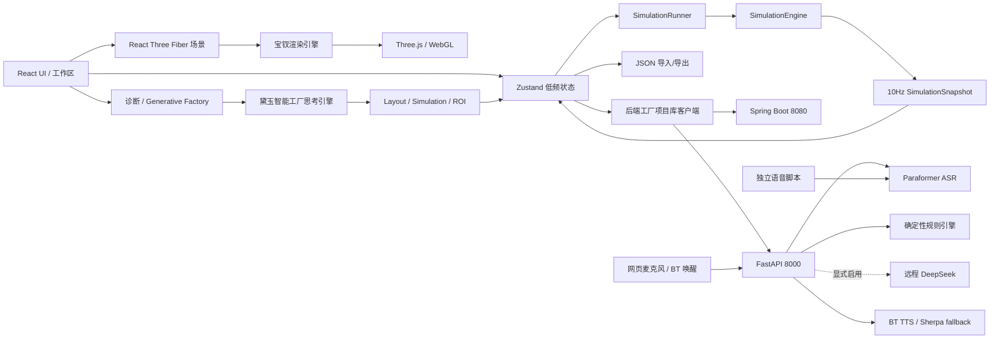
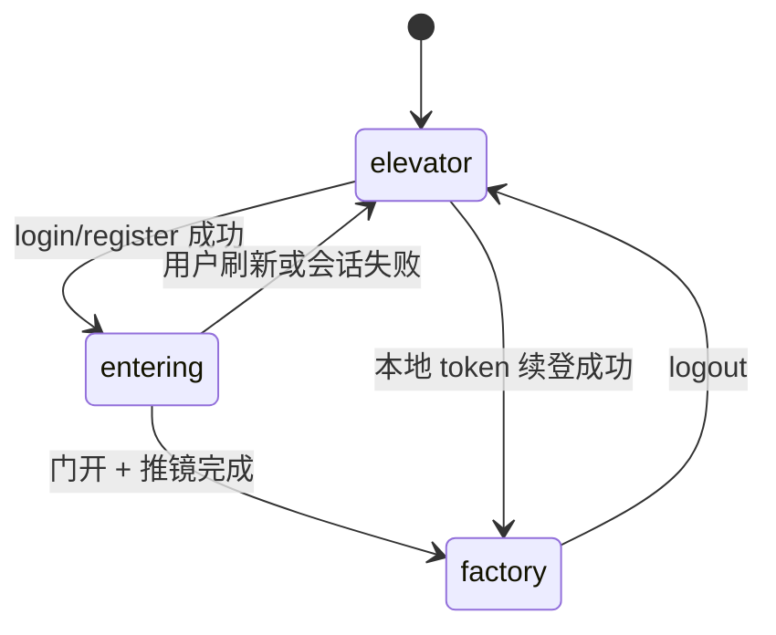
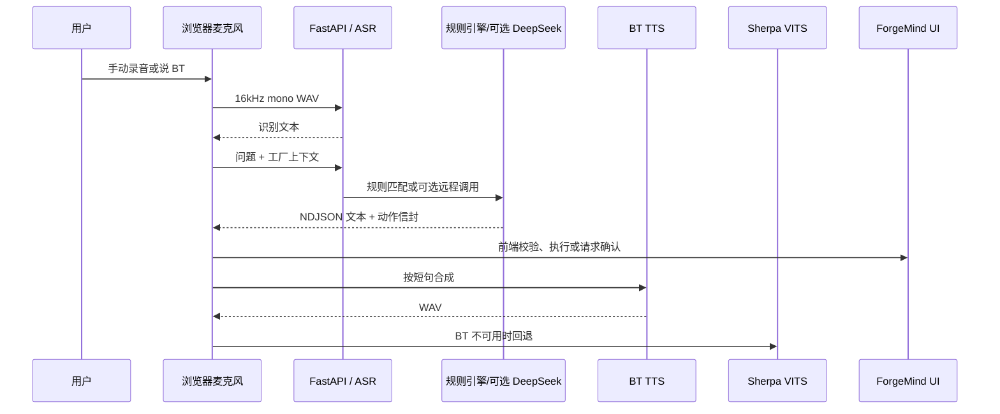
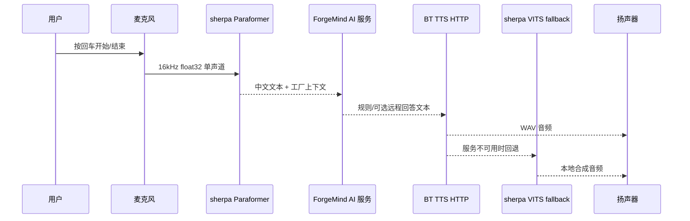
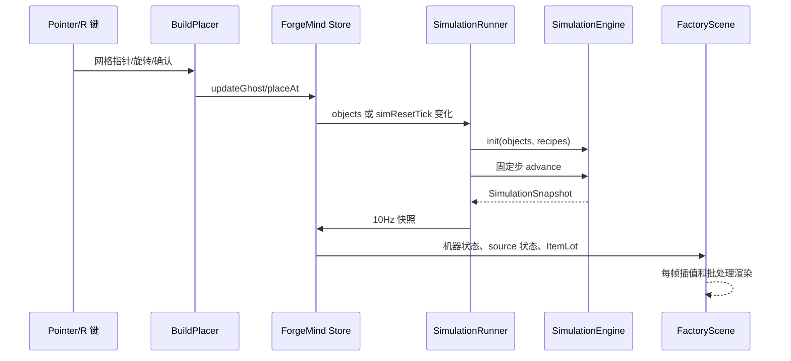

# ForgeMind 已实现功能模块技术文档

> 2026-08-19 融合基线：本文保留完整模块细节，但其中“本地 Ollama/Qwen 为默认链路”的描述已失效。当前默认是前端确定性规则模式；`ai-service` 显式启用后默认仍为 `rule`，只允许按服务端环境变量选择远程 DeepSeek，不再要求本地部署大语言模型。部署事实以根目录 `ForgeMind 项目方案.md` 与 `README.md` 为准。

**项目：** ForgeMind 智能工厂数字孪生平台  
**文档版本：** 0.2.0
**整理日期：** 2026-08-19
**适用范围：** 当前仓库中已经实现、可运行或已经建立接口契约的功能模块

本文档补充 [宝钗自研工厂渲染引擎技术文档](D:/Code/factory/docs/daiyu-render-engine.md) 和 [黛玉智能工厂思考引擎技术文档](D:/Code/factory/docs/daiyu-intelligence-engine.md)，重点说明 ForgeMind 除双引擎之外的业务、交互、仿真、数据和 AI 模块。文档中的“已实现”表示代码已经存在并可被当前应用调用；“骨架/占位”表示接口和数据契约已建立，但还没有接入完整生产能力。本版本按 2026-08-19 的代码状态整理；跨模块的事实索引见 [当前实现总览](D:/Code/factory/docs/ForgeMind-当前实现总览.md)。

## 1. 功能总览

| 模块 | 主要入口 | 当前状态 | 核心职责 |
| --- | --- | --- | --- |
| 应用壳与工作区 | `src/App.tsx` | 已实现 | 登录态切换、四种工作视图、全局快捷键、指标栏 |
| 生产控制台 | `src/components/ProductionWorkspace.tsx` | 已实现 | 俯视地图、设备登记、物流流向、产出统计和仿真控制 |
| 认证与登录演出 | `src/store/auth.ts`、`src/scene/LoginCameraRig.tsx` | 已实现 | 注册、登录、续登、登出、舱门动画和欢迎音频 |
| 工厂状态管理 | `src/store/forgeMind.ts` | 已实现 | 低频编辑状态、选择态、撤销重做、仿真快照 |
| 网格建造系统 | `src/scene/BuildPlacer.tsx`、`src/game/grid.ts` | 已实现 | 放置、碰撞、旋转、拖拽输送带、转角识别 |
| 多楼层工厂 | `src/game/floorVisibility.ts`、`src/scene/FactoryCanvas.tsx`、`FloorSwitcher.tsx` | 已实现 | 点击楼层自动开启并切换唯一编辑层；复用单个活动毛玻璃网格，额外显示层只有只读建筑，无楼板/地面/网格 |
| 设备目录与模型映射 | `src/game/types.ts`、`src/scene/EquipmentModel.tsx` | 已实现 | 设备规格、足迹、端口、吞吐、资产路径和视觉回退 |
| 设备资源导入 | `src/game/resourcePack.ts`、`ResourceImportDialog.tsx` | 已实现 | JSON/GLB 选择、拖放、字段校验、模型预览和封面生成 |
| 用户资源持久化 | `src/api/resources.ts`、`backend/.../ImportedResourceController.java` | 已实现 | 资源按用户保存、恢复、模型下载和引用归属校验 |
| 物品与配方 | `src/game/item.ts`、`ItemPanel.tsx`、`RecipePanel.tsx` | 已实现 | 多输入/多输出配方、加工时长和引用关系维护 |
| 离散事件仿真 | `src/game/simulation.ts`、`SimulationRunner.tsx` | 已实现 | 固定步生产物流、机器状态机、分流汇流、背压 |
| 场景和模型系统 | `src/scene/`、`public/models/` | 已实现 | 高精度工艺设备、Panda URDF、物料可视化、登录舱 |
| 仓储与 AGV | `src/components/WarehouseWorkspace.tsx`、`InfoPanel.tsx`、`AgvNavigationControl.tsx` | 已实现 | 有限货架、入货/出货边界、车辆悬浮三节点编程、真实库存装卸、路径、避让和实时状态 |
| 无人机跨层运输 | `src/components/InfoPanel.tsx`、`DroneNavigationControl.tsx`、`src/game/dronePathfinding.ts`、`src/game/simulation.ts` | 已实现 | 悬浮三节点编程、任意楼层仓储点真实装卸、26 邻域三维 A*、设施/动态净空、重规划和绝对标高路径呈现 |
| 宝钗渲染引擎 | `src/engine/daiyu/` | 已实现 | 精确实例化、预热、运行时审计和 4060 预算策略 |
| 黛玉智能工厂思考引擎 | `src/game/generativeFactory.ts` | 已实现 | 需求解析、产线生成、布局调整、路由校验、仿真评估、What-if 和 ROI |
| 后端工厂项目库 | `src/api/factoryProjects.ts`、`backend/` | 已实现 | 账号下多工厂新建、删除、完整 v6 保存与加载，以及每账号唯一覆盖式自动恢复槽 |
| JSON 导入/导出 | `src/game/save.ts` | 已实现（辅助） | 版本迁移、运行时校验和显式文件交换，不作为主存档 |
| Spring Boot 存档/认证后端 | `backend/` | 已实现 | MySQL/Flyway 持久化、BCrypt 密码、数据库会话 token、按用户隔离工厂和资源 |
| 可选智能服务 | `ai-service/main.py` | 已实现（规则/远程编排） | FastAPI 健康检查、规则/DeepSeek 助手、NDJSON 兼容响应、工具目录、ASR/TTS 网关 |
| 网页语音助手 | `src/components/AssistantVoiceButton.tsx`、`src/game/assistantVoice.ts` | 已实现（依赖本地服务） | 麦克风录音、`BT` 关键字唤醒、ASR、流式回答和 TTS 播放 |
| 独立语音助手 | `voice-chat/voice_chat.py` | 可选运行 | 本地 ASR → ForgeMind 规则/远程智能服务 → TTS；不直接访问本地 LLM |
| 仿真回归工具链 | `scripts/` | 已实现 | 闭环、转弯、分流、汇流、背压和 A-01 基地验证 |

## 2. 系统总体架构



### 2.1 分层原则

1. **业务数据层**：`FactoryObject`、`Item`、`Recipe` 描述工厂结构和工艺定义。
2. **仿真层**：`SimulationEngine` 只处理离散生产逻辑，不依赖 React 或 Three.js。
3. **状态协调层**：Zustand 保存编辑态和低频仿真快照；高频物料位置不进入响应式状态。
4. **宝钗渲染引擎**：Three.js/R3F 将对象和快照映射为视觉；宝钗负责批处理、预热和运行时预算。
5. **黛玉思考引擎**：读取 `FactoryState`、`GenerationSpec` 和仿真快照，生成可验证的布局候选、调整方案、诊断解释和经济性对照；它不直接操作 GPU 场景。
6. **外部服务层**：Spring Boot 负责持久化与认证，FastAPI 负责 AI/ASR/TTS 编排，均不进入实时仿真主循环。

## 3. 应用壳与工作区模块

### 3.1 视图模型

`src/App.tsx` 定义四种工作区视图：

| 视图 | 代码 | 相机 | 用途 |
| --- | --- | --- | --- |
| `overview` | 01 | 等距视角 | 查看基地布局和设备概况 |
| `build` | 02 | 俯视 | 网格放置、旋转和线路编辑 |
| `flow` | 03 | 生产控制台 | 俯视地图、设备登记、物流流向和产出统计 |
| `diagnostics` | 04 | 俯视诊断 | 查看仿真状态、堵塞和利用率 |

切换视图时，`changeView` 会自动退出建造工具，避免隐藏的 ghost 或拖拽状态继续影响场景。顶部导航、左侧工作区导航和视口快速切换 dock 共用同一个 `view` 状态。

### 3.2 指标和面板

当前右侧面板和工作区由以下低频组件组成：

- `SimPanel`：逻辑时间、在途物品、机器平均利用率、播放/暂停、倍率和产出/消耗。
- `InfoPanel`：选中设备的坐标、朝向、足迹、端口、配方或 source 输出绑定。
- `BuildMenu`：按采集、加工、装配、物流分类显示设备目录。
- `ItemPanel`：创建和删除物品类型。
- `RecipePanel`：创建和删除多输入/多输出配方。
- `ProductionWorkspace`：在 `flow` 视图中提供四个标签页：地图全览、设备详情、物流流向和产出统计；地图支持全部/加工设备/物流节点筛选、拖动浏览、节点选择和在途物料显示。
- `AssistantVoiceButton`：提供手动录音和 `BT` 关键字唤醒；浏览器只在本地内存保留短音频窗口并发送到本地 ASR 服务。

生产控制台的设备总数、加工单元、物流节点、产出总量、在途物料和设备利用率来自当前 store/仿真快照。生产效率目前仍显示固定的演示读数（仿真启动后为 `92.3%`），不能作为真实 OEE 或产线效率结论；可追溯实时量应以 `SimulationSnapshot.stats`、`MachineRuntime.processingTime` 和 `itemLots` 为准。

### 3.3 全局快捷键

- `Esc`：退出建造工具，并从非总览视图返回总览。
- `R`：旋转 ghost 或当前放置工具。
- `Ctrl+Z`：撤销。
- `Ctrl+Shift+Z` / `Ctrl+Y`：重做。
- 设备工作面板：`1/2/3` 切换分拣、焊接、装配任务；`M` 切换自动/手动；`Space` 发送夹爪命令。

输入框、文本域、下拉框和可编辑元素会屏蔽应用级快捷键，避免编辑表单时误操作工厂。

## 4. 认证与登录演出模块

### 4.1 认证状态机

`src/store/auth.ts` 使用三个阶段驱动 UI 和相机：



- `elevator`：只显示电梯舱，`LoginCameraRig` 独占相机。
- `entering`：登录成功后打开舱门、播放欢迎音频并推镜进厂。
- `factory`：挂载完整 UI、`OrbitControls` 和正常工厂交互。

### 4.2 前端认证流程

`src/api/auth.ts` 提供：

| 方法 | 路径 | 作用 |
| --- | --- | --- |
| `register` | `POST /api/auth/register` | 注册并返回 token |
| `login` | `POST /api/auth/login` | 登录并返回 token |
| `fetchMe` | `GET /api/auth/me` | 用 Bearer token 获取当前用户 |
| `logout` | `POST /api/auth/logout` | 删除服务端数据库会话 |

请求默认 5 秒超时。成功 token 写入 `localStorage['forgemind.token']`；应用挂载时调用 `restoreSession`，续登失败会清理 token 并回到电梯舱。

### 4.3 舱门与推镜

`LoginCameraRig` 采用帧循环而非 CSS 动画：

- 舱门打开：1350 ms，`smoothstep` 缓动。
- 门开确认停顿：360 ms。
- 推镜进入工厂：2100 ms，`easeInOut` 缓动。
- `ElevatorCabin` 通过共享的 `doorState.t` 驱动门叶位移、灯光强度、入口光幕透明度和地板轨道运动。
- 相机越过 `x < -11.92` 的舱体隐藏阈值后立即隐藏电梯舱，避免进入工厂后继续渲染舱体。

登录成功后 `App.tsx` 播放 `/audio/welcome_home_bt.wav`。音频播放失败不会阻塞入场动画。

### 4.4 后端安全边界

Spring Boot 当前使用 BCrypt 保存密码哈希；会话 token 是 UUID，服务端只把 token 的 SHA-256 摘要保存到 MySQL，默认有效期 30 天。因此：

- 密码不会明文落盘。
- 后端重启后 token 仍可续用，过期会话会在校验时清理。
- 当前没有完整 Spring Security 过滤链、刷新 token、角色权限和限流。
- `@CrossOrigin(origins = "*")` 适合本地演示，不适合生产部署。

## 5. 工厂状态管理模块

### 5.1 Zustand 状态边界

`src/store/forgeMind.ts` 是编辑器和 UI 的低频状态中心。主要字段包括：

```ts
objects: FactoryObject[]
items: Item[]
recipes: Recipe[]
selectedId: string | null
buildType: BuildType | null
ghost: Ghost
ghostPath: GridPos[]
simSnapshot: SimulationSnapshot
simPlaying: boolean
simSpeed: number
```

设计约束是：对象布局、绑定关系和 UI 状态进入 store；每一帧的传送带 offset、机器骨骼和渲染矩阵不进入 store。

### 5.2 编辑历史

编辑器维护最多 80 个 `FactoryHistoryEntry`，每条记录包含 `objects` 和 `selectedId`。放置、删除、旋转、绑定配方和绑定物品会进入历史栈；撤销/重做同时递增 `simResetTick`，让 `SimulationRunner` 重新初始化仿真。

导入存档和清空工厂会清空历史栈，避免跨存档撤销产生对象引用错乱。

### 5.3 引用一致性

删除物品时，store 会同步删除所有配方中引用该物品的输入/输出端口，并移除完全没有端口的配方，避免仿真读取悬空 `itemId`。删除配方不会自动清理机器上的 `recipeId`，因此后续可增加绑定引用检查或自动解绑。

## 6. 网格建造与线路编辑模块

### 6.1 坐标和足迹

`src/game/grid.ts` 规定：

- 1 格 = 1 米。
- `GridPos` 的 `x/z` 是对象足迹的最小角锚点。
- `gridToWorld` 将格子中心转换为 Three.js 世界坐标。
- 对象视觉锚点使用旋转后足迹的几何中心。
- `rotation` 只允许 `0/90/180/270` 四个方向。
- 建造边界为 `BUILD_BOUND = 24`。

`rotatedFootprint` 在 90°/270° 时交换宽深；`occupiedCells` 枚举旋转后的所有占用格。

### 6.2 放置合法性

`canPlace` 按以下顺序判断：

1. 计算旋转后的足迹。
2. 检查足迹是否越出 `[-24, 24]` 建造边界。
3. 枚举候选对象和已有对象的占用格。
4. 使用格子集合判断是否重叠。

因此碰撞是离散格碰撞，不依赖 Three.js 包围盒，也不会因模型视觉细节或阴影边界造成误判。

### 6.3 指针、ghost 和旋转

`BuildPlacer` 使用 Three.js `Raycaster` 将屏幕指针投射到 `y=0` 平面，再通过 `Math.floor` 转成网格坐标。移动时更新 ghost 的位置和合法性；`GhostPreview` 根据 `ghost.valid` 显示合法/非法状态。

按 `R` 后旋转 90°，旋转结果会立即重新经过 `canPlace` 校验。左键确认放置，空工具状态下点击地面会清除选择。

### 6.4 输送带连续拖拽和转角

右键会把当前位置写入拖拽锚点，随后 `buildPath` 将多个锚点和当前指针拼成 Manhattan 路径：先沿 X，再沿 Z。`pathRotations` 根据相邻格计算每段方向，逐段调用 `placeAt`。

线路转角由 `getConveyorLinks` 根据上游/下游连接方向识别：

- 直线段使用精确滚筒模型和方向箭头。
- 90° 转角使用专用程序化 `ConveyorCorner`，避免模型朝向和实际物流方向不一致。
- 转角不使用普通直线滚筒批次，保证视觉和仿真端口语义一致。

### 6.5 端口语义

`objectPortCells` 为每类对象计算外部输入/输出格：

- 普通设备：后侧输入、前侧输出。
- `splitter`：后侧输入，前/左/右三路输出。
- `merger`：后/左/右三路输入，前侧输出。
- `assembler`：三个独立 line-side dock，允许不同物料从不同方向进入。
- `source`：3×2 复合来料站只使用近中心实体皮带所在的单条输出通道。
- `conveyor`：输入允许后/左/右，输出保持单一方向，支持 Manhattan 转角线路。

真实连接不仅要求端口格相邻，还要求上游输出端和下游输入端重合；仿真和视觉端口标记共用这套计算。

## 7. 设备目录、资产映射与模型回退

### 7.1 设备定义

`src/game/types.ts` 中的 `OBJECT_DEFS` 是设备目录唯一来源，包含：

- 业务类型和角色。
- 中文名称、英文副标题、功能描述。
- 模型或资产路径。
- 足迹、颜色、强调色、高度。
- 吞吐、能耗、输入、输出和端口定义。

当前设备类型包括货物存取站、有限货物仓储架、入货仓库、出货仓库、滚筒/跨层输送线、基础加工机器、数控中心、液压冲压、精密装配、视觉检测、清洗去毛刺、AGV、无人机、分流器和汇流器。旧成品缓存能力已合并进普通货物仓储架，不再作为建造项。

### 7.2 资产来源分类

`BUILD_ASSET_PATHS` 将设备划分为：

- **中心拆分资产**：从中心工业模型中抽取的通用工作站、输送段、数控中心、Panda 装配单元和检测模块。
- **独立高精度工艺资产**：冲压、清洗、仓储、流节点等独立 GLB。
- **程序化结构**：没有对应外部节点的简单货架、基础底座、箭头和状态指示。

`EquipmentModel` 为每类设备提供 `Suspense` 回退。GLB 加载失败时显示程序化设备，而不是让整个场景挂起或出现空白。

### 7.3 精度保护

运行时优化共享几何、材质和实例矩阵，不修改 `public/models` 中的原始 GLB、DAE 和 URDF。模型精度、业务足迹和端口作用分开管理：模型负责视觉，`OBJECT_DEFS`/`grid.ts` 负责业务碰撞和连接。

## 8. 物品与配方模块

### 8.1 数据模型

`src/game/item.ts` 定义：

```ts
type ItemCategory = 'raw' | 'intermediate' | 'product'

interface Item {
  id: string
  name: string
  category: ItemCategory
  color: string
  size: number
  note?: string
}

interface Recipe {
  id: string
  name: string
  inputs: RecipePort[]
  outputs: RecipePort[]
  durationSec: number
}
```

`Item` 是类型定义；仿真中的在途实体是 `ItemLot`，二者不能混淆。

### 8.2 默认工业词汇

系统预置钢制毛坯、冷轧钢板、铜线盘、标准紧固件、机加工壳体、冲压壳体、洁净零件、电机总成和已检电机等物品，并提供机加工、冲压、线圈绕制、紧固件齐套、清洗、电机装配、视觉终检和包装配方。

### 8.3 配方编辑器

`RecipePanel` 支持：

- 选择输入物品和数量。
- 选择输出物品和数量。
- 设定加工时长。
- 在提交前删除端口行。
- 在列表中删除配方。

提交条件是名称非空、至少一个输入和至少一个输出；加工时长在 store 中被限制为不小于 0.1 秒。

### 8.4 设备绑定

`InfoPanel` 为机器提供配方下拉框，为 source 提供输出物品下拉框。绑定结果写回 `FactoryObject.recipeId` 或 `FactoryObject.itemId`，随后触发仿真重建，保证运行时使用最新配置。

## 9. 离散生产仿真模块

### 9.1 运行原则

`src/game/simulation.ts` 是纯 TypeScript 仿真内核，也是生产逻辑唯一真相源。它不导入 React、Three.js 或 DOM，可在浏览器、Node 脚本和未来后端引擎中复用。

固定参数：

| 参数 | 值 | 含义 |
| --- | ---: | --- |
| `SIM_STEP` | 0.05 s | 固定逻辑步长，20 Hz |
| `CONVEYOR_SPEED` | 2 格/s | 传送带离散槽位推进速度 |
| `SOURCE_INTERVAL` | 1.0 s | source 产出计时 |
| `SOURCE_TRANSFER_TIME` | 1.2 s | source 拾取/放置动画对应的逻辑时长 |
| `LOAD_TIME` | 0.5 s | 机器收料过渡 |
| `OUTPUT_TIME` | 0.3 s | 机器出料过渡 |

引擎使用累加器吸收真实时间，将每次 `advance(dtSec)` 拆成多个固定 50 ms 步；最多执行 1000 步，避免浏览器长时间冻结后出现无限追赶。

### 9.2 Source 生命周期

Source 状态为 `idle`、`picking`、`placing`、`blocked`：

1. 没有绑定 `itemId` 或没有下游时进入 `blocked`。
2. 达到产出间隔后开始 transfer。
3. 前 52% 进入 `picking`，后续进入 `placing`。
4. 到达 100% 时尝试把物品放入下游传送带或机器输入缓冲。
5. 下游满时保持 `blocked`，物品不会凭空生成。

### 9.3 传送带和在途物品

每个传送带运行时容量为 1 个 `ItemLot`：

```ts
interface ItemLot {
  id: string
  itemId: string
  conveyorId: string
  offset: number // 0..1，沿当前段的进度
}
```

物品每个固定步增加 `CONVEYOR_SPEED * dt`。到达 `offset >= 1` 后按输出端口尝试进入下游：

- 空的传送带：转移到下一段并重置 offset。
- 可接收的机器：进入机器输入缓冲。
- 空格：作为工厂出口，物品离开场景。
- 下游满或端口不连接：offset 固定为 1，形成头堵。

传送带按对象 ID 排序后推进，保证同一布局和同一种子下的结果稳定。

### 9.4 机器状态机

机器状态为 `idle → loading → processing → output`：

- `idle`：检查配方所有输入是否满足数量。
- `loading`：消耗输入并执行收料过渡。
- `processing`：按配方时长推进，并累加 `processingTime`。
- `output`：尝试把第一个输出端口的产品送入下游；下游满时停留在 output。

`SimulationSnapshot` 对 UI 暴露机器状态、进度、输入缓冲、累计加工时间、在途物品和产出/消耗统计。

当前数据结构支持多输出配方统计，但机器路由仍按 `recipe.outputs[0]` 放入下游，这是 MVP 的明确边界。

### 9.5 分流、汇流和连接校验

- `splitter` 使用 `branchCursor` 轮询三条输出，优先选择当前游标后第一个可接收分支。
- `merger` 使用后/左/右三个输入端口，统一从前侧输出。
- `isConnected` 要求上游占用格和下游输入端口格相交；不满足时不允许传输。
- 大尺寸设备的中心双通道和装配单元的多 dock 均由 `objectPortCells` 统一处理。

### 9.6 仿真驱动器

`SimulationRunner.tsx` 在 App 顶层挂载一个模块级 `SimulationEngine` 单例：

- 固定种子 `20260813`。
- `requestAnimationFrame` 获取真实时间。
- 根据 `simPlaying` 和 `simSpeed` 推进引擎。
- 仅每秒 10 次把 `getSnapshot()` 写入 Zustand。
- 对象、配方变化或 `simResetTick` 变化时重建引擎。

这样 React 只处理低频快照，Three.js 可以继续以每帧频率渲染物料位置和机械动作。

## 10. 场景、物料与机器人模块

### 10.1 场景组织

`FactoryCanvas` 负责 Canvas、相机、灯光、雾、网格地面、场景预热、登录舱和相机控制；`FactoryScene` 负责对象分组和渲染批次选择。

对象按类型拆分为传送带、通用机器、AGV、冲压、清洗、仓储、source、inspection 和 Panda 批次。动态对象仍可回退到 `FactoryObjectMesh` 独立渲染。

### 10.2 物料视觉

`ItemLotMesh` 将仿真快照中的 `ItemLot` 映射到当前传送带对象的位置和方向，显示为轻量占位物料。物料位置来自仿真状态，不在渲染层自行决定物流结果。

### 10.3 Panda 机械臂

`PandaArmModel` 使用 `/models/panda/panda.urdf` 和 DAE visual link：

- 模板 Promise 单例加载，避免每台机械臂重复解析 URDF。
- 加载完成后等待视觉 Mesh 和有限包围盒，再进行 Z-up 到 Y-up、归一化和底面对齐。
- 静止机械臂进入 `DaiyuPandaBatch` 精确批次。
- source 拾取/放置或装配工作时，恢复独立 URDF 关节树。
- 自动动作使用低迭代 Damped Least Squares IK；手动模式支持键盘和 Gamepad。
- 通过 `forgemind:robot-command` 自定义事件接收任务、模式和夹爪命令。

### 10.4 登录舱和正式工厂相机

登录阶段不挂载 OrbitControls，避免舱门推镜与用户控制抢夺相机。正式工厂阶段根据视图选择相机预设，并以 960–1380 ms 的过渡时间插值到目标位置。建造模式暂时禁用 OrbitControls，避免拖拽线路时同时旋转视角。

宝钗的批处理、预热、阴影和性能数据详见独立文档，不在本篇重复展开；黛玉的生成、调整和评估链路见独立思考引擎文档。

## 11. 存档、导入导出与后端同步

### 11.1 本地存档格式

`FactorySave` 当前版本为 2：

```ts
interface FactorySave {
  version: number
  savedAt?: string
  objects: FactoryObject[]
  items: Item[]
  recipes: Recipe[]
}
```

`serializeSave` 生成格式化 JSON；`downloadSave` 使用 Blob 和临时 URL 下载；`readFileAsText` 读取用户选择的 JSON 文件。

### 11.2 运行时校验

`parseSave` 会检查：

- 顶层对象是否有效。
- `objects/items/recipes` 是否为数组。
- 位置、旋转、类别、端口数量和物品引用是否合法。
- 配方端口引用的 `itemId` 是否存在。

未知字段会被忽略，关键字段错误会抛出中文错误，`LeftPanel` 将错误显示给用户。

### 11.3 存档版本与兼容性

当前存档版本为 v6。解析器接受 v1–v5 并迁移为 v6，同时拒绝缺失、非法或未来版本；除对象、物品和配方外，v6 还保存工厂名称、动态楼层及楼层名称、参数化物品数据、机器定义、端口配置、货物存取程序、有限货架容量/初始库存、入货/出货仓库以及可选仓储实例 `displayName`。旧档缺少该字段时回退设备类型，旧对象 `name/customName` 会兼容迁入。对象、物品、配方和机器定义 ID 会检查重复与引用关系，避免加载后出现悬空数据；运行中的 Spring Boot JAR 与源码共同接受 v1–v6，并携带 V8 自动恢复迁移。

### 11.4 后端工厂项目库

`src/api/factoryProjects.ts` 提供带认证和超时的账号项目库客户端：

| 方法 | 路径 | 作用 |
| --- | --- | --- |
| `listFactoryProjects` | `GET /api/factories` | 列出当前账号全部存档 |
| `createFactoryProject` | `POST /api/factories` | 新建并写入完整工厂项目 |
| `fetchFactoryProject` | `GET /api/factories/{projectId}` | 加载指定项目 |
| `updateFactoryProject` | `PUT /api/factories/{projectId}` | 覆盖保存指定项目 |

登录后的项目入口直接展示账号后端存档；新建工厂会立即创建后端记录，顶部“保存到后端”只在用户主动点击时覆盖当前正式项目。定时恢复只写 `factory_autosave` 中当前账号唯一的一行并反复覆盖，既不创建新的正式项目，也不替用户保存到当前正式存档；项目库允许删除正式存档或清除自动恢复槽。“导入 JSON / 导出当前 JSON”位于项目库底部，明确作为文件交换辅助能力。

## 12. Spring Boot 后端模块

### 12.1 技术栈和持久化

- Java 17。
- Spring Boot 3.3.5。
- `spring-boot-starter-web`。
- `spring-boot-starter-jdbc` + MySQL Connector/J。
- Flyway 数据库迁移。
- `spring-security-crypto`，只用于 BCrypt。
- MySQL 数据库 `forgemind` 保存用户、会话、账号下多工厂、完整版本化项目载荷、结构化索引表和预留快照。

数据库初始化脚本位于 `backend/src/main/resources/db/migration/`；当前迁移为 v1–v8。高频 `ItemLot` 和机器运行态仍由仿真引擎持有，不写入实时 CRUD 表；`factory.save_json` 保存完整 v6 编辑态，既有结构化表保留用于旧存档兼容和后续索引。

### 12.2 REST 接口

认证接口：

| 方法 | 路径 | 说明 |
| --- | --- | --- |
| `POST` | `/api/auth/register` | 用户名至少 2 个字符，密码至少 6 位 |
| `POST` | `/api/auth/login` | BCrypt 校验后签发 UUID token |
| `GET` | `/api/auth/me` | `Authorization: Bearer <token>` |
| `POST` | `/api/auth/logout` | 删除数据库会话 |

工厂接口：

| 方法 | 路径 | 说明 |
| --- | --- | --- |
| `GET` | `/api/factories` | 返回当前账号的工厂项目摘要列表 |
| `POST` | `/api/factories` | 新建一份完整工厂项目 |
| `GET` | `/api/factories/{projectId}` | 返回指定项目摘要和完整存档载荷 |
| `PUT` | `/api/factories/{projectId}` | 覆盖指定项目并返回更新后的内容 |
| `GET` | `/api/factory/health` | 服务健康检查 |

后端只负责静态结构 CRUD，不推进前端实时仿真。未来如果迁移到 Java 仿真引擎，应先定义版本化事件协议，不能直接让 CRUD 接口修改运行时状态。

## 13. AI 服务模块

### 13.1 当前实现

`ai-service/main.py` 是 FastAPI 服务，监听默认 8000 端口，启用全域 CORS。当前接口：

| 方法 | 路径 | 返回 |
| --- | --- | --- |
| `GET` | `/api/ai/health` | `{"status":"ok","service":"forgemind-ai"}` |
| `GET` | `/api/ai/tools` | 版本化工具目录 |
| `POST` | `/api/ai/assistant` | 使用规则引擎或显式配置的远程 DeepSeek，返回 `answer/source/note/action` 结构化响应 |
| `POST` | `/api/ai/assistant/stream` | 返回 NDJSON 增量文本和最终动作信封 |
| `POST` | `/api/ai/asr` | Paraformer WAV 语音识别 |
| `POST` | `/api/ai/tts` | BT TTS 代理，失败时回退 Sherpa VITS |

请求模型：

```json
{
  "question": "怎么提高产量？",
  "context": {
    "timeSec": 120,
    "bottlenecks": []
  }
}
```

助手默认使用确定性规则引擎，可返回普通文本或 `1.0.0` 工具动作；只有设置 `FORGEMIND_LLM_PROVIDER=deepseek` 且提供服务端密钥时才调用远程模型，失败后回到规则约束。服务端会对动作名称、协议版本、参数和上下文对象做基础校验，前端 `assistantProtocol.ts` 会再次校验并负责执行，因此 FastAPI 不直接改变工厂对象或仿真状态。默认前端不启动 AI 服务，`assistantRuntime.ts` 使用浏览器内置规则回复；显式启用后，`src/game/api.ts` 支持 NDJSON 响应和可选 TTS。

当前动作目录位于 `contracts/forgemind-assistant-tools.json`，共 8 个动作：查询工厂状态、读取对象、选择对象、启停仿真、设置仿真倍率、重置仿真、修改机器配方和绑定 source 物品。查询/定位/仿真控制可直接执行；重置、改配方和改 source 绑定被标记为需要确认的高风险或配置变更动作。

### 13.2 设计边界

AI 只能输出动作目录中的结构化请求，不能直接自由修改工厂。当前已完成协议版本、白名单、参数、对象角色、物品/配方引用和确认门控；副本仿真、产能差异报告和“优化建议先验证再写回”仍属于后续能力。

AI 服务不得进入 `SimulationRunner` 的每帧或每个固定步，否则会把 LLM 延迟引入实时链路。

## 14. 网页与离线语音助手模块

### 14.1 处理链路

网页端 `AssistantVoiceButton` 已接入主工作区，但只有使用 `-IncludeAI` 显式启动可选服务后才开放入口；实际录音、`BT` 关键字唤醒和播报还需要完整可选依赖及 `FORGEMIND_VOICE_ENABLED=true`。浏览器端负责采集单声道音频、重采样到 16 kHz、调用本地 ASR，并将识别文本交给统一的 `assistantRuntime`。默认启动不申请麦克风权限、不加载语音模型，也不要求任何本地大语言模型。

网页处理链路：



独立模式仍由 `voice-chat/voice_chat.py` 提供，不共享网页会话：



### 14.2 模型和运行约束

- ASR：Paraformer int8 ONNX，4 线程。
- TTS fallback：Sherpa-ONNX VITS 中文模型，4 线程。
- 助手 Provider：默认 `rule`；仅在服务端显式设置 `FORGEMIND_LLM_PROVIDER=deepseek` 时使用远程 DeepSeek。
- BT TTS：`http://127.0.0.1:8001/tts`，不可用时回退本地 VITS。
- 输入小于 0.3 秒或低于静音阈值 `0.01` 时丢弃。
- 识别到“退出”或“再见”时结束循环。

网页语音入口已能通过统一动作协议驱动当前支持的仿真控制和配置动作，但仍受协议白名单、对象引用校验和用户确认限制；独立 `voice-chat` 程序仍只提供对话播报，不直接向网页工厂发送动作。任何新语音动作都必须先加入协议目录和前端执行器，不能让语音文本直接执行任意设备操作。

## 15. 测试与验证工具链

### 15.1 npm 脚本

```bash
npm run build
npm run sim
npm run sim:smoke
npm run sim:regression
npm run sim:backpressure
```

`npm run build` 执行 TypeScript 项目构建和 Vite 生产打包。`scripts/run-sim.mjs` 使用 esbuild 将 TypeScript 测试脚本临时 bundle 成 Node 可执行模块，结束后清理临时目录。

### 15.2 回归覆盖范围

`scripts/sim-regression.ts` 当前覆盖 7 类场景：

1. 基础 Source → 传送带 → 机器 → 出口闭环。
2. 90° 转弯线路。
3. 三向分流器轮询。
4. 双输入汇流器和多输入配方。
5. 下游拒收时的头堵与背压。
6. 3×2 大型设备的中间入口/出口通道。
7. Source `picking → placing → grid lot` 生命周期。

`base-a01-check.ts` 额外检查 A-01 预置布局的边界和碰撞、设备类型完整性，并运行 300 秒仿真确认电机装配、终检和包装链路闭合。

### 15.3 性能验证入口

宝钗开发诊断参数（参数名保留 `daiyu` 历史标识）：

- `?daiyuStress=300`：生成最多 600 个不写入 store 的压力对象。
- `?daiyuDpr=1.86`：固定开发环境渲染 DPR，用于近 1080p 采样。

性能指标、P95 帧时、场景审计和 4060 Laptop 实测结果统一记录在 [宝钗渲染引擎文档](D:/Code/factory/docs/daiyu-render-engine.md) 中。

## 16. 端到端数据流和不变量

### 16.1 建造到仿真



### 16.2 必须保持的不变量

- `rotation` 只取四个方向，且同时决定视觉朝向和物流方向。
- 任何对象不能越出建造边界或与其他对象占用格重叠。
- 传送带满时只能头堵，不能穿透、丢失或凭空复制物料。
- 机器只有在输入数量齐备且配方存在时才能进入 loading。
- 渲染层不能替代仿真层决定物料去向。
- AI、网络请求和语音推理不能进入实时固定步循环。
- 原始模型资产不因性能优化而被隐式减面、替换或改变作用。

## 17. 启动和排障手册

### 17.1 仅运行前端

```bash
npm install
npm run dev
```

访问 `http://localhost:5173`。后端项目库是登录后保存和加载工厂的主入口；显式 JSON 导入/导出只用于文件交换或人工备份。后端未启动时，登录与项目库会显示连接错误。

### 17.2 启动 MySQL 与 Spring Boot

```bash
docker compose up -d mysql
cd backend
mvn package
java -jar target/forgemind-backend-0.1.0.jar
```

默认端口 8080。检查 `http://localhost:8080/api/factory/health`。

### 17.3 启动 AI 服务

```bash
cd ai-service
py -3.10 -m venv .venv
.venv/Scripts/pip install -r requirements.txt
.venv/Scripts/python -m uvicorn main:app --port 8000
```

检查 `http://localhost:8000/api/ai/health`。默认会报告规则 Provider 且 `localModelRequired=false`；不需要额外模型进程。若显式选择 DeepSeek，需在服务端设置 API Key。语音功能同样是可选能力，未启用时不加载 ASR/TTS 模型。

### 17.4 典型问题定位

| 现象 | 优先检查 |
| --- | --- |
| 登录显示 `Failed to fetch` | Spring Boot 是否监听 8080，浏览器是否允许本地跨源请求 |
| 物料不动 | source 是否绑定物品、机器是否绑定配方、端口方向是否连接 |
| 传送带末端停住 | 下游是否满、是否没有配方、是否形成预期背压 |
| 机械臂不显示 | Panda URDF/DAE 路径、模型请求、Daiyu 批次是否接管、浏览器控制台错误 |
| 导入存档失败 | JSON 版本、对象类型白名单、配方引用的物品是否存在 |
| 舱门动画卡顿 | 宝钗预热状态、Panda 是否在隐藏祖先下跳过 IK、DPR 和阴影预算 |

## 18. 多楼层、仓储与跨层物流补充

### 18.1 楼层模型

`FactoryCanvas` 根据 `floorId` 把对象放到对应世界高度，`FloorSwitcher` 分别维护当前编辑层和逐层上下文显隐。点击任一楼层会清除上一层选择和建造工具，再把它设为唯一可交互层；活动层以高于显示开关的优先级直接显示，但不会自动改动该层开关。当前层显示项目原有的单个 `GridFloor` 毛玻璃地面及 1m 网格。其他开启楼层只渲染建筑、物流对象和在途状态，不渲染楼板、地面或网格，也不绑定选择、拖动或详情修改事件。跨层传送带要求两端楼层都处于最终可见集合。L1 是仓储和生产层；L2 是加工/冲压/绕线层；L3 是多输入装配、视觉质检、包装和成品缓冲层。

### 18.2 无人机运输

`src/game/dronePathfinding.ts` 根据任意楼层的仓储/货架取货点与卸货点生成绝对标高航路。寻路使用确定性 26 邻域三维 A*，横纵、面对角、体对角代价分别为 `1`、`√2`、`√3`，允许 X/Y/Z 同时变化，并把设施体积、1.2m 建筑净空和 3m 动态无人机间距纳入安全包络。选中无人机后的设备详情直接提供旧版式“起点装货 → 货物/每趟件数 → 终点卸货”三节点编程，仓储工作区也保留机队总览；仿真运行后支持阻塞检测、重规划和恢复，暂停时不推进运输任务。新放置或未编程无人机没有默认路线和预装货物。

### 18.3 仓储边界与车辆装卸

普通货物仓储架使用 `storageConfig.capacity` 和按物品拆分的 `initialInventory` 建立有限运行时库存；存取站、AGV 与无人机都只能从真实数量中取货，并在目的货架满仓时保留在途货物等待。入货仓库是无限供货边界，实际取出时增加物品消耗台账；出货仓库是不可逆无限容量终点，实际存入时增加物品产出台账，之后不能成为车辆供货起点。三类仓储实例均可设置最长 40 字符的 `displayName`，设备详情、仓储总览、AGV 与无人机选择器通过 `getFactoryObjectDisplayName` 使用同一回退规则。AGV 与无人机运行时均从零载货开始，未完成三节点编程时保持原地待命。

### 18.4 标签与面板可见性

设备、车辆和仓储区域标签属于场景空间内容，不应穿透工作区面板。三维标签和 HUD 面板分别处于不同渲染层；排查标签漏到其他界面时，优先检查场景 overlay 的挂载范围、当前 floor 可见性和面板的 z-index/portal 容器。建造面板展开后，选中建筑详情使用 `310×460px` 上限的内部滚动短窗；设备详情中的原生下拉框和数字框统一使用浅色底、深色字，避免暗色玻璃面板继承浅蓝文字后失去对比度。

## 19. 资源导入与用户隔离补充

### 19.1 前端流程

`BuildMenu` 打开 `ResourceImportDialog`。对话框支持拖放或文件选择，读取资源 JSON 和 GLB，使用 `parseForgeMindProject` 做字段校验，使用 `Model3DViewer` / `ImportedFactoryModel` 预览模型，并生成设备卡片封面。解析成功后资源先进入 Zustand，用户可以立即在建造目录中使用。

### 19.2 后端流程

登录态下由 `src/api/resources.ts` 调用 `/api/resources` 保存资源。Spring Boot 的 `ImportedResourceController` 和 `ImportedResourceDbStore` 把元数据、项目 JSON、GLB 文件名和二进制写入 `imported_resource`。`App.tsx` 在恢复工厂阶段加载当前用户资源并重新建立模型 Blob URL；切换用户时 `forgeMind` 会清理旧资源和 URL。

### 19.3 安全不变量

- 资源列表、GLB 下载和工厂保存都使用 bearer token；
- `factory_object` 只有在 `resourceId` 属于当前用户时才能保存；
- 未登录或后端不可用时，导入可以用于本地预览，但不能被标记为已云端持久化；
- 新增资源类型时，同时检查前端 `OBJECT_DEFS`、资源包解析器、Spring Boot 对象白名单和迁移/回归样例。

## 20. 当前边界与后续路线

### 已知边界

- MySQL 使用 Docker 持久卷；删除 `forgemind_mysql_data` 会清空开发数据。
- AI FastAPI 默认使用规则引擎和动作协议；远程 DeepSeek 是显式可选项，生成或诊断结论仍必须经过确定性校验。
- 网页语音入口已经接入工作区，但仅在可选 AI 服务启动后开放，依赖浏览器麦克风权限、Paraformer 和 TTS；独立 `voice-chat` 仍不共享网页会话。
- 本地和后端存档校验均覆盖当前完整设备目录；新增设备类型时仍需同步更新前后端白名单和回归样例。
- 机器多输出配方的数据结构已支持，但运行时下游路由仍使用第一个输出。
- A-01 中部分 KPI，以及生产控制台的固定“生产效率 92.3%”，是演示读数，不等同于仿真统计。
- 可选视觉、语音与三维场景同时运行时的长时间稳定性仍需实机认证。

### 推荐演进顺序

1. 补充工厂成员邀请、角色权限和多工厂选择 API。
2. 为 AI 增加副本仿真、差异报告和优化建议确认流程；当前 action schema、双层校验和确认门控已完成。
3. 让独立语音助手复用网页端的版本化安全命令协议，并增加会话/权限边界。
4. 增加自动化浏览器验收、显存采样、温度采样和 LLM 并行压力测试。
5. 在模型资产不变的前提下评估 HLOD、WebGPU 和离线纹理压缩。

## 21. 代码索引

| 路径 | 说明 |
| --- | --- |
| `src/App.tsx` | 应用壳、视图切换、KPI、快捷键和登录音频 |
| `src/components/ProductionWorkspace.tsx` | 生产控制台的地图、设备登记、物流和产出标签页 |
| `src/components/AssistantVoiceButton.tsx` | 网页端手动录音和 BT 关键字唤醒入口 |
| `src/store/forgeMind.ts` | 编辑器、历史栈、物品/配方、仿真快照 |
| `src/store/auth.ts` | 认证阶段和本地 token 续登 |
| `src/game/types.ts` | 设备目录和 `FactoryObject` 类型 |
| `src/game/grid.ts` | 足迹、碰撞、端口和世界坐标 |
| `src/game/item.ts` | Item、Recipe 和默认工业词汇 |
| `src/game/simulation.ts` | 固定步长离散仿真唯一真相源 |
| `src/game/SimulationRunner.tsx` | rAF 驱动器和 10Hz 快照桥接 |
| `src/game/save.ts` | 本地存档序列化、解析和下载 |
| `src/game/api.ts` | Spring Boot 存档和 FastAPI AI 客户端 |
| `src/api/resources.ts` | 用户资源保存、列表恢复和鉴权模型下载 |
| `src/game/resourcePack.ts` | 资源包解析、校验、规范化和封面输入 |
| `src/components/ResourceImportDialog.tsx` | 建造页资源导入窗口 |
| `src/components/WarehouseWorkspace.tsx` | 仓储控制、运输层和物料台账 |
| `src/components/AgvNavigationControl.tsx` | AGV 导航任务和路径控制 |
| `src/components/DroneNavigationControl.tsx` | 无人机跨层运输任务与实时三维路径控制 |
| `src/game/dronePathfinding.ts` | 26 邻域三维 A*、装卸停靠候选和安全包络 |
| `src/scene/DroneRouteVisual.tsx` | 绝对标高航路与实时节点呈现 |
| `src/scene/FactoryFloorSystem.tsx` | 三维楼层容器和可见性 |
| `src/game/assistantProtocol.ts` | 智能管家 1.0.0 动作目录、上下文和前端校验 |
| `src/game/assistantExecutor.ts` | 智能管家动作执行、确认门控和仿真控制桥接 |
| `src/game/assistantVoice.ts` | 浏览器录音、WAV 编码、ASR 和关键字监听 |
| `src/game/assistantRuntime.ts` | 流式回答、短句 TTS 队列和动作执行桥接 |
| `src/scene/BuildPlacer.tsx` | 射线拾取、ghost、拖拽线路和快捷键 |
| `src/scene/FactoryCanvas.tsx` | Canvas、相机、场景分组和宝钗接入 |
| `src/scene/FactoryObjectMesh.tsx` | 单对象渲染、端口标记和转角视觉 |
| `src/scene/EquipmentModel.tsx` | 设备模型映射、加载和程序化回退 |
| `src/scene/PandaArmModel.tsx` | Panda URDF、IK、自动/手动控制 |
| `backend/src/main/java/com/forgemind/web/` | 认证和工厂 REST 控制器 |
| `backend/src/main/java/com/forgemind/web/ImportedResourceController.java` | 用户资源 REST 控制器 |
| `backend/src/main/java/com/forgemind/repository/ImportedResourceDbStore.java` | 资源元数据和 GLB 持久化 |
| `backend/src/main/resources/db/migration/V5__create_user_imported_resources.sql` | 用户资源表 |
| `backend/src/main/resources/db/migration/V6__add_resource_reference_to_factory_objects.sql` | 工厂设备资源引用 |
| `ai-service/main.py` | FastAPI AI/ASR/TTS 编排服务 |
| `voice-chat/voice_chat.py` | 本地 ASR/LLM/TTS 语音闭环 |
| `scripts/sim-regression.ts` | 仿真回归测试 |
| `scripts/base-a01-check.ts` | A-01 布局和 300 秒生产闭环检查 |
