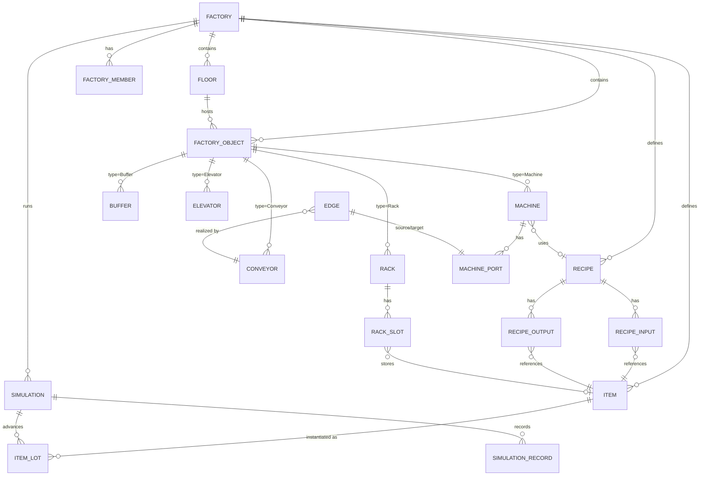

# ForgeMind 方案补充设计（V2 增补）

> 本文是对《AI 驱动的智能工厂数字孪生设计与仿真平台项目方案》67 节的**补充与收敛**，不覆盖已达成一致的内容，只补此前评审指出的待收敛点，并纳入四项新需求：
>
> 1. UI 采用《明日方舟：终末地》的近未来工业机能风
> 2. 模型要求高精度高细节，允许引入网络公模
> 3. 补齐仿真引擎内核、数据模型、架构边界、阶段规划等设计
> 4. 评估 iron-arm 机械臂手柄操控 demo 的复用价值
>
> 关键前提：**团队规模 1 人，周期 7 天。** 本文所有范围判断都以此为准。

> **实现状态说明（2026-08-19）：** 本文保留了早期“1 人 × 7 天”的范围收敛和目标架构，不能再当作当前功能清单。当前代码已经超出该冲刺边界：已实现 L1/L2/L3 多楼层、L2/L3 产线、仓储/AGV/无人机导航、按楼层诊断、设备 JSON+GLB 导入、模型封面预览，以及按用户隔离的资源数据库持久化。当前事实以 [ForgeMind 当前实现总览](D:/Code/factory/docs/ForgeMind-当前实现总览.md) 和代码为准。

---

# 0. 早期范围重估（1 人 × 7 天）

## 0.1 结论先行

原方案的五阶段愿景在早期 7 天单人周期下**不可行，也不需要一次做完**。这一段是历史范围判断；当前项目已继续完成多楼层、物流、诊断和资源导入，当前实现以总览文档为准。

## 0.2 早期 7 天内必须交付（历史硬目标）

| 模块 | 范围 |
|---|---|
| 单楼层工厂 | 1 层，网格建造，设施放置 + 旋转 + 碰撞 |
| 通用机器 | 1 种通用 Machine，绑定 Recipe，输入/输出口 |
| 传送带 | 直线段 + 手动 90° 转角，物品沿带真实移动 |
| 自定义 Item | 名称/类别/尺寸/默认模型；自由上传在早期冲刺中暂缓，当前已通过用户私有资源导入落地（见 §2） |
| Recipe | 多输入多输出，加工时长，产能推导 |
| 机器加工 | 状态机：待料 → 加工 → 输出 |
| 3D 运输 | 物品实体在传送带上插值移动 |
| 基础统计 | 产量 / 机器利用率（简单计数） |
| 保存 | 早期工厂 JSON 导入/导出（历史范围；当前另有 Spring Boot/MySQL 云端存档） |

## 0.3 早期 7 天内明确砍掉（历史记录）

- 多楼层、垂直运输、升降机
- AGV、无人机、A* 寻路、多车调度
- 全部分流/合流/Buffer 高级逻辑（MVP 只留直线传送带）
- AI 分析、瓶颈检测、AI 优化、方案仿真（第 4/5 阶段）
- 自由上传 GLB（改为内置默认模型 + 预留接口）

## 0.4 双栈的落地顺序

已确认长期架构为 **Java（Spring Boot）+ Python（FastAPI）双栈**。按 vibecoding 思路，两套后端**直接都建**，不因运维成本砍 Python：

- **7 天冲刺**：前端（React + Three.js）为绝对主体；Spring Boot 做极薄后端（工厂结构 / 配方数据 CRUD，或先用 JSON 存储）；Python FastAPI **同步建起来**，负责 LLM API 编排——即便第一版只暴露一个"AI 助手"入口，也把服务占位立住。
- **目标架构**：§5 给出的双栈职责边界与通信方式作为演进蓝图。仿真引擎仍留在 Java 侧，Python 只做离线 AI（绝不进实时链路）。

---

# 1. UI 设计规范（终末地风格）

## 1.1 设计语言

终末地 UI 的核心是 **扁平化 + 低饱和度 + 近未来工业机能风**，关键词：秩序、克制、工业印刷质感。对 ForgeMind 的三段式布局（左建造菜单 / 中 3D 工厂 / 右数据面板，原方案 §52）用这套语言重塑即可，**不必照搬其"表盘式主界面"**——那是主机 RPG 的主菜单形态，不适合工具型编辑器。

## 1.2 设计 Token（可直接落地为 CSS 变量 / Tailwind theme）

| Token | 值 | 用途 |
|---|---|---|
| 背景主色 | `#0d1117` ~ `#161b22`（深灰蓝） | 全屏基底，工业暗色 |
| 面板色 | `rgba(20,26,34,0.72)` + `backdrop-filter: blur` | 半透明玻璃面板 |
| 面板描边 | `1px solid rgba(120,160,200,0.18)` | 细边框，HUD 感 |
| 主强调色 | 青蓝 `#4fc3f7` ~ `#29b6f6` | 选中态、激活态、光标 |
| 次强调色 | 品红 `#ec407a`、黄 `#fbc02d` | 状态色（警告/提示）、CMYK 点缀 |
| 文字主色 | `#dbe4ee` | 正文 |
| 文字次色 | `#8b98a9` | 次要说明 |
| 成功/危险 | `#66bb6a` / `#ef5350` | 放置合法/非法、运行/故障 |
| 圆角 | `2px`（直角 + 小切角） | 工业硬朗，避免大圆角 |
| 发光 | `0 0 0 1px` + 低强度外发光（bloom） | 选中与运行态 |

## 1.3 标志性视觉元素（终末地特征，低成本可做）

1. **CMYK 印刷色条**：面板角落 / 加载页放一段 `青—品红—黄` 三色细条，是最省成本也最能点题的工业印刷符号。
2. **CAD 坐标系参考线**：3D 视口角落叠加细线网格 + 十字坐标轴，暗示"工业数模软件"。
3. **斜切角面板**：面板四角切掉 45° 小角 + 四角小刻度线，替代传统圆角，强化 HUD 机能感。
4. **半透明 + 描边按键**：按钮用半透明底 + 细描边 + 悬停时描边变强调色。
5. **传送带剪影装饰**：数据面板的分组标题旁用一段带弧度的色块剪影做分隔，呼应工业输送带。

## 1.4 字体选型（来自 ignoredone.space/fontlab）

字体统一取自 [ignoredone.space 字体库](https://www.ignoredone.space/index.php/fontlab/) 分享，按终末地"工业机能风"选型如下：

| 用途 | 字体 | 备注 |
|---|---|---|
| 中文正文 / UI 主字体 | **MiSans**（首选）/ HarmonyOS Sans / AlibabaPuHuiTi | 规整无衬线，工业感，均免费商用 |
| 中文标题 / 大数字 | **AlimamaShuHeiTi**（阿里妈妈数黑体） | 硬朗黑体，面板标题、产量大数字 |
| 数字 / ID / 坐标 / 日志 | **Another Typewriter** / Veteran Typewriter（打字机体） | 等宽，控制中心读数感 |
| 英文标题 / 装饰 | Bebas Neue / Hanson Bold | 窄体大写，硬工业感 |
| 印刷质感点缀（可选） | 京華老宋体v3.0 / 思源宋体（Noto Serif SC） | 呼应 CMYK 印刷，品牌/大标题 |
| 像素 / 终端装饰（可选） | Press Start 2P / Pixel-Digivolve | 终端/状态角标 |

**排字规则**：

- 数字/代号（Item ID、Recipe ID、坐标、产量）一律用打字机等宽体，右对齐或表格式排布，强化"控制中心"读数感。
- 字号层级克制：3 级以内（标题 / 正文 / 标注），避免信息堆叠——终末地英文评测唯一被诟病的是"菜单层级偏多"，ForgeMind 要反着来：**一屏少层级、少弹窗**。
- 英文手写体/花体（Great Vibes、Pinyon Script、exmouth、Vincente 等）与工业机能风冲突，**跳过不用**。

> 字体文件在该站 `/wp-content/uploads/fontlab/*.woff2` 路径下（如 `京華老宋体v3.0.woff2`）。中文字体多为免费商用（MiSans、HarmonyOS Sans、阿里巴巴普惠/数黑/方圆体）；个别英文字体（Clash Display、Satoshi 等）有各自授权，学习答辩使用无风险。

## 1.5 技术选型与开源组件

- **框架**：React 18 + TypeScript + Vite（已确认）。
- **样式**：TailwindCSS（快速写 token）+ 自定义 `design-tokens.css` 集中管理 §1.2 的值。
- **工业 HUD 组件（主用）**：[`@spectre-ui/core`](https://www.npmjs.com/package/@spectre-ui/core) —— 35+ 未来感 FUI 组件，MIT 许可、npm 即装即用，基于 Radix UI（可访问性）+ Framer Motion + Tailwind；含 `GlowBorder` / `GridBackground` / `ScanBeam` / `ScanlineOverlay` / `SystemTicker` / `TerminalText` 等 HUD 装饰组件，配套 [`@spectre-ui/tailwind-config`](https://www.npmjs.com/package/@spectre-ui/tailwind-config) 提供切角边框（`spectre-hud-corners`）、网格背景、扫描线、辉光等 utility。是当前最接近"工业控制中心"观感、且可 npm 直接装的库。
- **备选 / 参考**：[SCIFICN/UI](https://dev.to/jqueryscript/copy-paste-sci-fi-components-built-on-radix-ui-scificnui-27oi)（shadcn 复制粘贴式，30+ 组件，等宽 + 切角 + HUD 面板 + 三套主题，偏"复古终端"风，切角与等宽处理可借鉴）、[Cosmic UI](https://next.jqueryscript.net/tailwind-css/sci-fi-ui-components-cosmic/)（SVG 优先、框架无关）、[Arwes](https://github.com/arwes/arwes)（全框架含音效，alpha 阶段）。
- **基础组件**：radix-ui primitives（无样式的可访问性基座，自由套终末地皮肤）；避免直接用 Ant Design 等成品库——它们默认风格与终末地差异大，改造成本反而高。
- **动效**：Framer Motion（面板滑入、状态切换过渡，克制使用）。
- **图标**：lucide-react（线性图标，贴合机能风）。
- **3D 后处理**：`@react-three/postprocessing` 的 `Bloom`（选中/运行态低强度发光）。

> 说明：终末地没有官方或粉丝开源组件库；@spectre-ui/core 是风格最接近的"工业 HUD"通用库，终末地特有装饰（CMYK 色条、CAD 坐标线、传送带剪影）仍需自建 token + 少量装饰（§1.3）。@spectre-ui/core 周下载量低、单维护者，属小众库，但 MIT 且源码可读，vibecoding 场景够用；若担心稳定可直接 copy 其 HUD 装饰组件源码进项目。

---

# 2. 模型规范（高精度、公模引入）

## 2.1 定位

"高精度高细节"对**展示型资产**（机器、机械臂、无人机、传送带底座）有意义；对**批量移动的物品实体**（成百上千件）高精度反而致命（draw call 与显存）。因此分两类处理：

| 类型 | 精度策略 | 渲染策略 |
|---|---|---|
| 机器/设施（每厂几十个） | 高精度公模，几万面可接受 | 单独 Mesh，可选阴影 |
| 物品实体（每厂上千） | 低面数（< 1 万面/件） | InstancedMesh 合批 |

## 2.2 公模来源（按许可优先级）

| 来源 | 内容 | 许可 | 备注 |
|---|---|---|---|
| [cobot-atlas](https://huggingface.co/datasets/torusprime/cobot-atlas) | 2023+ 个机器人/工业 GLB（机械臂、夹爪、移动底盘、工业件） | 学习答辩直接可用 | 与本项目"机器/机械臂"最匹配 |
| [Meshy.ai 工业机械类](https://www.meshy.ai/zh/subcategory/industrial-machinery) | 7786+ 工业机械模型，含 GLB | 明确 **CC0** | 可商用、免署名，首选 |
| [Free3D 机械臂模型包](https://free3d.online/model/6334427-futuristic-robotic-arm-model-pack-with-articulated-joints) | 科幻机械臂（含关节） | 免费，学习答辩直接可用 | 机械臂类候选 |
| [Open Source 3D Assets](https://www.opensource3dassets.com/en) | 991+ GLB 场景/道具 | 多为 CC0 | 偏场景道具，工业件少 |
| [iron-arm panda 模型](https://github.com/YJsnz/iron-arm) | Franka Panda 官方 URDF + 网格（.dae） | 官方模型 | 直接可作"机械臂"设备参考，见 §6 |

> 许可说明：本项目**仅用于学习答辩、不商用**，因此上表所有来源（cobot-atlas、Free3D、Meshy、Open Source 3D Assets、Panda 官方模型）均可直接使用，无需严格核对商用条款。若未来转商用，再回来逐条核对 cobot-atlas 与 Free3D 的单条许可（Meshy 为 CC0、Panda 为官方模型，本就安全）。

## 2.3 模型规范化流水线（上传/导入时统一处理）

早期 7 天冲刺先不做"自由上传"，只做**内置默认资产包**；当前已经补上用户私有 JSON+GLB 导入，仍沿用下面的规范化原则：

1. **格式**：GLB / GLTF（二进制）。
2. **bbox 归一化**：计算包围盒 → 自动居中 → 缩放到网格足迹（如 1×1 或 2×1 格）。
3. **坐标原点**：统一到物体底面中心（`y=0` 为底面），与网格对齐。
4. **硬上限**：文件体积、三角面数设上限，超限拒绝或降采样（Decimate）。
5. **压缩**：几何走 Draco、贴图走 KTX2（three.js 均原生支持），减小传输与显存。
6. **缩略图**：生成图标供物品面板/列表使用。
7. **单位**：统一米，处理 glTF 单位不一致。

## 2.4 默认资产清单（7 天内置，够用即可）

- **物品模型**（低面数，供 InstancedMesh）：金属板、金属块、纸箱、圆柱体、电子元件、托盘、液体桶。
- **机器模型**（1–2 个高精度公模）：通用加工机、装配机（从 Meshy/cobot-atlas 挑）。
- **设施模型**：传送带段（直线 + 转角）、Buffer（可选）。
- **可选加**：机械臂（复用 iron-arm 的 Panda URDF，见 §6）。

---

# 3. 仿真引擎内核设计

> 这是此前评审的最高优先级补项：仿真引擎是"不做对就翻车"的核心，必须先定真相源、时间系统、确定性，再谈别的。

## 3.1 唯一真相源（Source of Truth）

- **后端逻辑态是唯一真相源**：物品在哪台机器、加工进度、队列长度、传送带上的逻辑位置，全部由后端仿真引擎持有。
- **前端只做确定性插值渲染**：前端根据"逻辑时间 + 路径参数"推算出视觉位姿，**不自己推进仿真状态**。
- 后果：暂停、回放、倍率切换、断线重连，都靠"后端状态快照 + 逻辑时钟"恢复，前端永远是被动消费方。

```
后端仿真引擎（权威逻辑态）
   │  tick 快照（10~20Hz）
   ▼
前端渲染层（确定性插值 → 视觉位姿）
```

## 3.2 时间系统（固定步长 + 逻辑时钟）

- 引擎用**固定步长**推进（如 50ms 一步），与浏览器 `requestAnimationFrame` 解耦。
- 前端维护一个**逻辑时钟** `t = 服务端逻辑时间`，倍率只影响逻辑时间前进速度：
  - 暂停 = 冻结逻辑时钟；
  - 50× = 逻辑时间每墙钟秒前进 50 秒。
- **物品位姿 = 路径上的参数函数 `s(t)`**，而非逐帧增量累加。这样倍率越高动画越准，不会出现跳变/穿透。
- 这是 Factorio 等工厂游戏的标准做法。

## 3.3 确定性（种子化随机数）

- 引擎内置**种子化 PRNG**，每次 Simulation 记录种子。
- 配方概率产出、废品率全部走同一随机流。
- 用途：未来"优化前后对比 +27.1%"这类结论必须可复现、可审计（同种子同结果）。7 天冲刺虽不做优化对比，但种子机制应从一开始就埋好。

## 3.4 核心状态机

- **Item 类型 vs ItemLot 实例**：`Item` 是类型定义；`ItemLot`（在途物品实例）才是"传送带上第 37 号钢板"，含位置/载体/方向/速度/目标节点。二者必须区分（原方案 §45 遗漏了 ItemLot）。
- **Machine 状态机**：`待料(idle) → 收料(loading) → 加工(processing，按配方时长推进) → 出料(blocked/输出) → 待料`，输出口满则停在出料态（背压）。
- **Conveyor**：见 §3.5 离散模型。
- **加工口径**：统一为 `配方加工时长 = 配方基准时间 / 机器速度系数`，产能由 `3600 / 时长` 推导，杜绝"秒"与"件/min"混用。

## 3.5 传送带离散模型（关键补项）

传送带**不能只做"恒速路径插值"**，否则无法模拟拥堵与缓冲，而拥堵正是瓶颈分析的数据来源。MVP 采用简化离散模型：

- 传送带切分为**分段槽位（segments/cells）**，每段一个容量（通常 1 件）。
- 物品按速度沿槽位前进，**头堵则整带停**（前一件停，后一件随之停，逐段向后传播）。
- 与机器输入口耦合：机器满则入口段停。
- 后续再接 Buffer/分流/合流时，复用同一套"下游满 → 上游停"的背压语义。

## 3.6 规模目标

- MVP 目标：**≤ 1000 在途物品实例、≤ 50 机器、单楼层**，50ms 步长下流畅。
- 达到目标的手段：后端用 SoA/批处理推进；前端用 InstancedMesh + 增量快照；规模上限在冲刺第 1–2 天用基准原型锁死，不事后补救。

---

# 4. 数据模型（修正 ER）

> 本节的 PostgreSQL/Redis 叙述属于目标架构。当前可运行实现使用 MySQL 8.4 + Flyway；实际表和迁移以 [后端数据库设计](D:/Code/factory/docs/ForgeMind-后端数据库设计.md) 为准。高频运行态仍留在前端仿真内存。

## 4.1 原方案 §45 实体清单的补丁

新增以下遗漏实体（原方案有 Machine/Conveyor/Rack/Buffer/Splitter/Merger 但缺这些）：

| 新增实体 | 用途 |
|---|---|
| `Edge` / `Connection` | 承载传送带连接机器端口的源/目标 + 方向，落地 §30 的"有向图 Edge" |
| `ItemLot` / `MaterialInstance` | 在途物品实例（位置/载体/方向/速度/目标节点），区分 Item 类型 |
| `Elevator` | 升降机/垂直运输 |
| `Warehouse` | 仓储（与 Rack 区分，Rack 是格口货架） |
| `FactoryMember` / `Role` | 权限与多人协作（原方案 §48 提权限、§59 提多人但无实体） |
| `Route` / `RoutePoint` | AGV/Drone 的路径序列（后续阶段） |
| `SimulationSnapshot` | 工厂快照版本，支撑 §41 仿真副本的可复现 |

## 4.2 核心 ER（mermaid）



## 4.3 FactoryObject 继承建模策略

- 目标架构可用**单表 + `type` 字段 + 扩展属性列**；当前实现使用 MySQL `factory_object` 单表和结构化列，导入资源通过 `resource_id` 关联 `imported_resource`。
- 高频仿真运行时状态（ItemLot、机器实时状态）**不入 MySQL**，只存前端引擎内存 + 定期快照；MySQL 当前存静态结构、用户会话和导入资源。

## 4.4 三层数据流

```
权威逻辑态（引擎内存，SoA）      ← 唯一真相源
   │
   ├─ Redis（跨实例广播总线，可选，单机可省）
   │
   └─ MySQL（当前静态结构 + 资源二进制；定期快照仍预留）
```

当前开发运行不依赖 Redis/Kafka；Spring Boot 使用 MySQL 持久化结构，前端仍支持 JSON 离线存档，运行态全在内存。Redis/Kafka 仍是未来多实例异步分析的可选方案。

---

# 5. 架构收敛（双栈职责边界）

## 5.1 归属裁定（目标架构与当前实现）

当前实现的仿真、AGV/无人机路径和诊断主要在前端 TypeScript 运行；Spring Boot 负责用户、工厂结构和资源持久化。下面的 Java 实时引擎描述仍是目标架构，不是当前启动流程。

- **目标架构中的仿真引擎 = Java/Spring Boot 侧**：A* 寻路、产能计算、瓶颈检测等**每个 tick 都要跑**的实时算法全部在引擎侧，绝不跨进程调 Python；当前版本这些运行逻辑主要由前端 TypeScript 承担。
- **Python/FastAPI = 只做离线**：LLM 编排、离线数据分析、方案评分等非实时批处理。

## 5.2 通信（目标架构）

- Spring Boot ↔ FastAPI 用**异步消息**（Redis Stream 或 Kafka），传"分析请求/结果"。
- 仿真引擎把汇总的生产/库存/运输统计写入时序存储，Python 读离线数据做 AI。
- **绝不走同步 REST 进实时链路**。

## 5.3 前端架构（本次落地）

- **React + Zustand**：Zustand 只装**低频状态**（选中对象、面板开关、配方表单、统计汇总）；高频仿真实体位置**不进响应式 store**。
- **Three.js 场景图**：高频物品位置用命令式直接更新（配合 InstancedMesh），避免上千实体每帧触发 React/Zustand 依赖收集导致卡顿。
- **通信**：7 天冲刺可用"本地单进程模拟"（前端自己推进一个简化引擎）先跑通 3D 链路；要接后端时用 tick 快照 + 前端插值（§3.1）。

> 关键结论：**React 管 UI，Three.js 管渲染，二者只在低频层交集**。这是防性能翻车的第一原则。

---

# 6. iron-arm 复用评估

## 6.1 结论

**设计参照价值高，前端机械臂 IK 可直接复用，但服务端 IK 需 Java 重写。** iron-arm 是"Franka Panda 7 轴机械臂 + 盖世小鸡手柄遥操作"的纯前端 demo（Vite + Three.js + urdf-loader），与 ForgeMind 的"机械臂/机器人设备"模块高度相关。

## 6.2 可直接复用（前端）

| 文件 | 内容 | 复用方式 |
|---|---|---|
| `src/ik.js` | **自研 DLS（阻尼最小二乘）Jacobian 逆运动学**：几何雅可比逐列构建、关节限位裁剪、高斯消元求 6×6、含 CONVERGED/STALLED/TIMEOUT 状态，约 150 行 | 若 ForgeMind 需要"机械臂按目标位姿运动"（如装配机、码垛机视觉），前端可直接移植；代码自包含、只依赖 three.js 向量/四元数 |
| `src/hardware.js` | **硬件接口抽象层**（`SimHardware` no-op + 预留 `RosHardware`/`SerialHardware`/`UdpHardware`，接口 `connect/sendJointState/sendGripper/onState/dispose`） | 直接借鉴其"仿真逻辑与真机解耦"的接口设计，对应 ForgeMind 的模块化设施抽象 |
| `src/mapping.js` | 参照 Isaac Lab `Se3Gamepad` 的手柄→SE(3) 增量映射（死区 + 速度倍率） | 若未来做手柄操控设备，可照抄思路 |
| `public/models/panda/` | Franka Panda 官方 URDF + 网格（.dae） | 直接作为"机械臂"类设备的默认模型（§2.4） |

## 6.3 局限与移植注意

1. **深度耦合 urdf-loader**：`ik.js` 从 urdf-loader 加载的 robot 结构里取关节世界矩阵/轴/限位，依赖 `robot.joints[name].axis`、`.limit`、`.setJointValue` 等接口。移植时要么引入 urdf-loader，要么把"关节轴/限位/正向运动学"抽成自己的接口。
2. **数学依赖 three.js**：前端复用没问题；但 ForgeMind 的仿真引擎规划在 Java 侧，**服务端 IK 需用 Java 重写**（可用 `org.joml` 矩阵库，逻辑照抄 DLS Jacobian，约 1–2 天）。
3. **范围**：iron-arm 只有机械臂 + 手柄，**没有**传送带、产线、配方、仿真引擎——它是 ForgeMind 的一个"设备子模块"参照，不是地基。

## 6.4 建议用法

- 把 Panda 机械臂作为 ForgeMind 的**"机械臂"类设备模板**（一个高精度、可动的展示型设备）。
- 把 `ik.js` 移植为前端"机械臂 IK 模块"，作为模块化设施体系（原方案 §44）里第一个"高级设备"。
- 服务端 IK 留到需要"机械臂抓取参与生产仿真"时再 Java 重写（不在 7 天范围）。

---

# 7. 7 天冲刺拆解（单线推进）

> 不含测试（按需求先不补测试）；每天结束都应有"可看"的东西，而非空跑代码。

| 天 | 目标 | 产出 |
|---|---|---|
| Day 1 | 环境 + 3D 骨架 | Vite + React + Three.js 跑通；网格地面 + 相机 + 终末地风格 token 起步 |
| Day 2 | 网格建造 | 放置/旋转/碰撞机器与传送带段；放置预览 ghost 高亮（合法/非法着色） |
| Day 3 | Item + Recipe + 数据模型 | Item/Recipe 表单 + Zustand 状态；保存/加载 JSON |
| Day 4 | 仿真内核 | 简化引擎：固定步长 + 逻辑时钟 + 机器状态机 + 加工推进 |
| Day 5 | 传送带 + 物品移动 | 传送带分段模型 + ItemLot 沿带插值移动 + 头堵传播 |
| Day 6 | 统计 + 打磨 | 产量/利用率面板（ECharts 或自绘）；终末地视觉元素（CMYK 条、斜切角、HUD 描边） |
| Day 7 | 演示脚本 + 收尾 | 按 §8 的演示脚本串成闭环；修观感与明显 bug；导出可演示版本 |

## 7.1 7 天内的"最小闭环"演示脚本

```
新建工厂(单层) → 建 Item A/B → 建 Recipe(A→B) →
放 1 台机器 + 绑定配方 → 用传送带接 Source→机器→出口 →
启动仿真 → 看 A 沿带进机器、加工、B 沿带出来 → 看产量计数
```

这条链路能"跑通 + 看得见"，即 7 天的及格线。多楼层、AGV、AI 均不出现在此脚本。

---

# 8. 分阶段路线（修正版）

原方案五阶段方向正确，但结合"1 人 7 天"调整为"**7 天冲刺 + 三档后续演进**"，并明确砍掉过度项：

| 档 | 范围 | 对应原方案 |
|---|---|---|
| **冲刺（7 天）** | 单层 + 机器 + 传送带 + Item/Recipe + 3D 运输 + 统计 + 保存 | 第 54 节 MVP 的再收敛 |
| 一档演进 | 多楼层 + Buffer + 分流/合流 + Rack/库存 + 数据埋点 | 第 55–56 节 |
| 二档演进 | AGV 单车 A* + 物流任务 + 自动补料/入库 | 第 56 节（先单车，多车调度后置） |
| 三档演进 | 瓶颈检测 + 规则版分析 + AI 助手（LLM 只做解释） | 第 57 节 |
| 目标架构 | Java+Python 双栈 + AI"动作库 + 副本仿真"受控优化 | 第 51、58 节 |

## 8.1 明确后置/降级项（防范围失控）

- **AI 自动工厂优化器 / 自动布局（第 42、59 节）**：NP-hard 组合优化，降级为"长期探索"，不纳入可交付承诺；若要做，用遗传算法/模拟退火做求解器，LLM 只做目标转译与结果解释。
- **AI 优化建议（第 41 节）**：从"LLM 自由生成自然语言"改为**"预定义动作库 + 结构化 schema + 后端合法性校验 + 副本仿真回算"**，LLM 只选动作、填参数，产出数字一律以副本仿真为准。
- **多车调度（第 27 节）**：MAPF/NP-hard，先用"预约表 + 时间窗 WHCA*"做次优解，不追求最优。
- **数据埋点**：从冲刺第 4 天起就把指标采集作为一等公民埋进引擎（计数器/时序），否则后续分析阶段要重构内核。

---

# 9. 一句话结论

本文的历史结论是“1 人 7 天先做单层核心闭环”；当前代码已在此基础上继续扩展。仿真真相源、确定性、传送带离散模型、双栈职责和 iron-arm 复用方案仍然有效，但实际数据库是 MySQL，实时运行态仍由前端 TypeScript 仿真持有。完整当前状态见 [ForgeMind 当前实现总览](D:/Code/factory/docs/ForgeMind-当前实现总览.md)。
