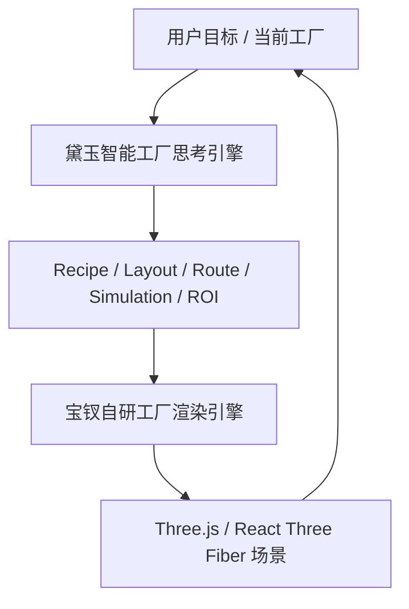

# 黛玉（Daiyu）智能工厂思考引擎技术文档

> 当前实现（2026-08-19）：规则解析、产品 Profile、候选布局生成、端口/碰撞校验、副本仿真、诊断和 What-if/ROI 已由 `src/game/factoryAI.ts`、`factoryDiagnostics.ts`、`generativeFactory.ts` 及 `GenerativeFactoryWorkspace.tsx` 提供。AI 服务只负责离线约束提取和解释，不能直接修改实时场景；用户导入资源、楼层和物流状态会作为生成与诊断输入的一部分，但资源持久化由 Spring Boot/MySQL 负责。跨模块事实以 [当前实现总览](D:/Code/factory/docs/ForgeMind-当前实现总览.md) 为准。

**项目：** ForgeMind 智能工厂数字孪生平台  
**引擎名称：** 黛玉（Daiyu）  
**引擎定位：** 工厂领域的需求理解、产线生成、布局调整、仿真评估与方案解释引擎  
**当前版本：** 0.1.0  
**实现位置：** `src/game/generativeFactory.ts`  
**协作引擎：** [宝钗（Baochai）自研工厂渲染引擎](D:/Code/factory/docs/daiyu-render-engine.md)

> 命名说明：宝钗负责“把工厂画出来”，黛玉负责“想清楚工厂应该怎样运行”。当前两套能力保持现有代码结构，不拆分为独立进程；引擎名称用于表达清晰的产品职责边界。

## 1. 为什么它可以称为“思考引擎”

黛玉不是一个只调用大语言模型并展示文本的聊天面板。它具备完整的规划闭环：

1. 接收自然语言生产目标或当前工厂状态。
2. 将目标归一化为结构化的 `GenerationSpec`。
3. 根据产品工艺图和设备能力估算设备需求。
4. 生成候选设备布局、输送线路和 AGV 路线。
5. 对碰撞、端口接入、物流可达性和产能进行确定性校验。
6. 通过副本仿真计算吞吐、利用率、物流效率和能耗等指标。
7. 使用多轮候选搜索、What-if 对照和 ROI 计算筛选方案。
8. 输出可应用到当前工厂的布局差异、诊断原因和下一步建议。

因此，黛玉的核心不是“生成一张看起来合理的图”，而是把生产需求变成一套可以放置、可以连接、可以仿真、可以解释的工厂方案。

## 2. 输入与输出契约

### 2.1 输入：`GenerationSpec`

典型输入包括：

```ts
{
  product: 'gearbox',
  targetThroughputPerHour: 120,
  floorWidth: 30,
  floorDepth: 20,
  maxCnc: 4,
  maxAgv: 3,
  objective: 'energy',
  searchRounds: 3,
  economics: {
    electricityPrice: 0.82,
    operatingHoursPerMonth: 624
  }
}
```

输入还可以来自 A-01 当前工厂快照。此时黛玉不会盲目重建全部工厂，而是先建立当前基线，再生成三类可比较结果：最小重布线、局部调整和完整重构。

### 2.2 输出：`GeneratedCandidate`

每个候选方案至少包含：

| 输出 | 作用 |
| --- | --- |
| `recipeGraph` | 描述产品、工序、输入输出关系和节拍 |
| `equipment` / `objects` | 设备数量、类型、坐标、旋转和业务绑定 |
| `conveyorRoutes` | 端口驱动的传送带路径和连接关系 |
| `validation` | 碰撞、上游接入、下游接入、路由可达性和警告 |
| `simulation` | 副本仿真读数和机器/物流运行状态 |
| `metrics` | 吞吐、利用率、物流效率、能耗等方案指标 |
| `economics` | CAPEX、月度收益、回本期和 12 个月 ROI |
| `adjustments` / `diff` | 从当前工厂到候选方案需要执行的动作 |
| `score` / `paretoRank` | 多目标排序和 Top 3 方案筛选依据 |

## 3. 端到端规划链路


大语言模型只处于可选输入理解边界：显式配置的远程 DeepSeek 可以帮助提取产品、产能、场地和约束，也可以生成诊断解释；默认规则模式不需要任何本地部署模型。布局坐标、设备数量、传送带路线、碰撞结论和指标必须由黛玉自己的确定性逻辑与仿真得到，因此模型服务不可用时前端仍能完成闭环，也不会由模型幻觉生成“看似接通、实际断开的”传送带。

## 4. 核心子系统

### 4.1 诊断与调整引擎

诊断模块读取当前工厂的结构、物流连接和仿真快照，识别瓶颈设备、断链、缓存不足、低利用率和潜在堵塞。调整引擎将结论转成可执行动作，并按风险分为：

- 基线保持：证明当前方案是否已经满足目标。
- 最小重布线：只调整必要的线路和局部设备。
- 完整重构：重新生成整条产线并比较收益。

### 4.2 产品画像与 Recipe Graph

产品画像提供默认工序、节拍、输入输出和设备类型。当前已覆盖电机和齿轮箱等演示画像；画像不是最终布局，而是后续设备估算和路由规划的工艺约束。

### 4.3 自动扩容与可行性守门

黛玉会根据目标产出和单台设备节拍估算 `requiredCount`，对 CNC 和单输入工序生成经过路由校验的并行设备。对于装配等多输入工序，只有在存在无碰撞、输入端口全部可达的路线时才允许扩容；无法证明接通时保留需求估算并输出警告，不放置未连接的假设备。

### 4.4 迭代候选搜索

初始候选经过布局、路由和仿真后，黛玉会围绕高分方案生成邻域变体，例如平移设备、改变工序间距、调整缓冲和改变 AGV 数量，再进行多轮 Beam Search。每一轮都必须重新校验连接和仿真，最终保留可行解中的 Top 3，而不是只按几何距离排序。

### 4.5 What-if 与经济性评估

What-if 用于回答“增加一台 CNC”“增加装配机”“增加一台 AGV”是否真的有效。系统同时展示吞吐变化、利用率变化、能源变化、CAPEX、月度收益、回本期和 12 个月 ROI。当上游 Source 或其他工序成为瓶颈时，增加 CNC 可能吞吐不变；黛玉会把这个结果解释为边际收益不足，而不是强行给出正向结论。

## 5. 与宝钗渲染引擎的关系



两者的职责边界如下：

| 问题 | 负责引擎 |
| --- | --- |
| 这条产线需要哪些工序和设备？ | 黛玉 |
| 设备放在哪里、怎样连线才可行？ | 黛玉 |
| 方案能否达到目标产能？ | 黛玉 + 仿真模块 |
| 机器、传送带和 AGV 怎样加载与显示？ | 宝钗 |
| 如何保留高精度模型同时稳定渲染？ | 宝钗 |
| 用户点击后如何把对象映射回业务 ID？ | 宝钗 + 业务层 |

黛玉输出工厂状态和候选布局，宝钗消费这些状态并完成视觉呈现。黛玉不直接创建 Three.js Mesh，宝钗也不负责决定生产工艺和路线。

## 6. 竞赛展示路径

推荐用一段连续操作展示黛玉的完整能力：

1. 进入 A-02，输入“生产齿轮箱，每小时 120 件，场地 30m × 20m，CNC 最多 4 台、AGV 最多 3 台，尽量降低能耗”。
2. 展示需求被解析成 `GenerationSpec`，随后出现 Recipe Graph 和设备需求估算。
3. 点击生成，机器、传送带和 AGV 路线逐步长出；画面同时显示连接校验和候选评分。
4. 打开 Top 3，对比吞吐、利用率、物流效率、能耗和 ROI。
5. 应用候选方案，切换到诊断页，查看瓶颈原因和可执行调整。
6. 运行 What-if：增加一台 CNC，展示“吞吐没有变化，因为上游 Source 已经成为瓶颈”的可解释结论。

结尾可以显示：

```text
GENERATED BY FORGEMIND
Throughput 123.7/h
Utilization 81.4%
Logistics Efficiency 92.1%
```

## 7. 当前实现边界

- 黛玉目前作为前端纯逻辑模块运行，尚未拆成独立服务或 Worker；本阶段保持现有架构不变。
- 大语言模型只做需求提取、解释和动作选择，确定性规划与仿真负责最终事实。
- 自动扩容优先覆盖 CNC 和单输入工序；多输入装配扩容必须通过完整路由可行性检查。
- 候选方案只有通过碰撞和端口接入校验后，才允许进入 Top 3 或应用到工厂。
- 终态指标来自副本仿真和规则计算，不能把模型生成的文本当作产能事实。

## 8. 后续升级方向

1. 将候选生成、碰撞校验和仿真放入 Web Worker 或后端 headless runner，支持更大的候选规模。
2. 为每次生成保存 `generationId`、输入快照、算法版本、随机种子和候选评分，形成可回放的方案档案。
3. 使用历史仿真结果学习布局先验和设备节拍，但保留确定性校验作为最终守门。
4. 增加在线调整模式：运行中发现堵塞后，黛玉生成不打断生产的微调方案，再由用户确认应用。
5. 为宝钗增加“方案过渡动画”和局部重建，让用户看到黛玉的决策如何落到真实三维工厂。
