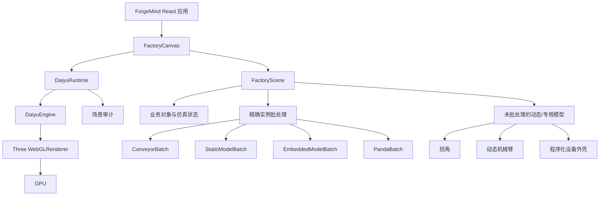

# 宝钗（Baochai）自研工厂渲染引擎技术文档

> 当前实现（2026-08-19）：渲染层已经覆盖自研 Daiyu runtime、工厂楼层容器、内置/用户导入模型、AGV 与无人机实体、传送带批处理和模型预览。资源导入的 JSON/GLB 校验与用户隔离不属于渲染引擎本身，分别由 `src/game/resourcePack.ts` 和 Spring Boot `/api/resources` 负责。标签、面板和楼层可见性仍需在场景层与 UI 层分别控制，不能把 HTML 面板当作三维遮挡系统。

**项目：** ForgeMind 智能工厂数字孪生平台  
**引擎名称：** 宝钗（Baochai）
**当前版本：** 0.1.0  
**文档状态：** 第一阶段实现说明  
**基线设备：** RTX 4060 Laptop，8 GiB 显存；预留约 5 GiB 给本地 LLM  
**实现位置：** `src/engine/daiyu/`

> 命名说明：本渲染层的正式产品名称为宝钗（Baochai）。由于 `src/engine/daiyu/` 和本文文件名已经被现有代码、调试参数及历史文档引用，路径中的 Daiyu 暂作为兼容标识，不代表产品名称。

## 1. 摘要

宝钗不是重新实现一套底层 GPU 驱动或 WebGL API，而是建立在 Three.js、React Three Fiber 和 WebGL 之上的“工厂领域渲染引擎层”。Three.js 继续负责几何、材质、光照和 GPU 指令；宝钗负责工厂场景特有的资源生命周期、精确实例化、渲染预算、登录预热、动态降载、机械臂资源复用和运行时审计。

它解决的是当前工厂场景的实际问题：模型数量从几十个增长到 300 个以上时，重复 GLB 被逐个提交、静止 Panda 机械臂重复执行完整 IK、登录舱门动画与完整工厂同时抢占主线程，以及大量端口标记和阴影造成的额外提交。

宝钗的核心约束是：**不修改原始模型资产，不减面，不换低模，不破坏物流和机械臂功能。**优化发生在运行时提交方式和场景生命周期上。相同的几何、材质、纹理和法线可以被多个实例共享，但每个工厂对象仍保留独立位置、旋转、选择状态和业务 ID。

当前第一阶段已经覆盖：

- 原始直线传送带 GLB 的精确实例化，拐角继续使用原有转角逻辑。
- 通用高精度工作站、AGV、冲压、清洗、仓储模型的精确实例化。
- 来料站内部传送带、检测站传感器和控制柜的复合模型实例化。
- Panda URDF/DAE 只解析一次；静止机械臂合批，动作时恢复独立关节树。
- 登录舱期间的隐藏工厂预热和分阶段着色器编译。
- 帧时、P95、draw call、三角形、几何体和纹理数量监控。
- 300 对象开发压力场景和接近 1080p 像素量的 DPR 压力测试。

## 2. 背景与问题定义

### 2.1 原始渲染路径

原始实现中，一个工厂对象通常对应一个 React Three Fiber 子树。即使两个对象引用同一个 GLB，场景仍可能创建两个 `primitive`，并在每帧由多个 Mesh、材质和阴影通道提交。设备数量增加后，成本大致随对象数和模型内部 Mesh 数量线性增长：

```text
对象数量 × 单个模型 Mesh 数量 × 渲染通道
```

这对 `realvirtual_high_detail.glb`、AGV、滚筒传送带和 Panda 机械臂尤其明显。模型本身没有错误，但 GPU 提交次数和主线程矩阵更新次数不断增加。

### 2.2 登录舱门动画问题

登录阶段原本同时存在舱门、登录相机、工厂模型和机械臂。工厂模型在视觉上大多被舱门遮挡，但仍会参与资源加载、阴影和渲染。若用户快速登录，完整工厂还可能在门体动画期间首次编译材质，导致明显卡顿。

### 2.3 机械臂问题

Panda 是 URDF + 多个 DAE 视觉文件组成的关节树。每台机械臂都需要独立的关节角和末端执行器姿态；但静止机械臂不应重复执行完整的 IK 求解，也不应为每一个静止实例重复提交完全相同的视觉网格。

### 2.4 目标硬件约束

基线为 RTX 4060 Laptop 8 GiB 显存，同时预留约 5 GiB 给本地 LLM。因此渲染层不能简单地把显存和 GPU 计算全部占满。宝钗的规划预算如下：

| 指标 | 目标 | 说明 |
| --- | ---: | --- |
| 目标帧率 | 60 FPS | 交互和舱门动画的最低目标 |
| 帧时间 | 16.67 ms | `1000 / 60` |
| draw call | 550 | 第一阶段警戒线，不是硬性 GPU 上限 |
| 可见三角形 | 3,000,000 | 原始模型不减面；用于观察压力 |
| 几何体数量 | 900 | Three renderer memory 计数 |
| 纹理数量 | 420 | Three renderer memory 计数 |
| 规划渲染显存 | 1024 MiB | 当前为规划阈值，尚未接入显存驱动级强制回收 |

> 三角形和 draw call 警戒线是监控预算，不代表为了达标而删除模型细节。最终是否满足目标必须结合目标分辨率、GPU 温度、LLM 负载和持续时间共同验证。

**资产保护边界：**本次宝钗改造只调整运行时的批处理、实例化、预热和降载策略；`public/models` 下的原始 GLB、DAE、URDF 等模型文件不做替换、压缩或重导出。若后续引入 HLOD、压缩纹理或离线烘焙，必须作为独立、可回滚的资产版本进行评审。

## 3. 总体架构



### 3.1 分层职责

| 层 | 主要职责 | 不负责的内容 |
| --- | --- | --- |
| 业务层 | 工厂对象、物流拓扑、仿真状态、选择状态 | GPU 提交策略 |
| `FactoryScene` | 按业务类型分组、决定批处理和动态对象 | 底层材质编译细节 |
| 宝钗运行时 | 生命周期、预算、统计、预热、审计 | 改写业务 store |
| 批处理组件 | 复用几何/材质，写入实例矩阵，映射点击事件 | 改变模型几何 |
| Three.js/R3F | 场景图、材质、相机、灯光、WebGL 指令 | 工厂业务语义 |
| GPU 驱动 | 实际光栅化和计算 | 业务对象管理 |

### 3.2 为什么这仍然可以称为自研引擎

宝钗没有替换 Three.js 的底层渲染后端，但它已经拥有独立的工厂领域渲染策略：

1. 自定义工厂对象分类和批处理规则。
2. 自定义渲染预算和超预算标签。
3. 自定义登录预热和资源生命周期。
4. 自定义静止/动态对象切换策略。
5. 自定义 Panda 资源池和 IK 降载策略。
6. 自定义场景审计和压力测试入口。

因此，准确的技术表述是：**基于 Three.js 的宝钗工厂领域自研渲染引擎层**。后续如果需要替换 WebGL 为 WebGPU，宝钗的业务层策略可以继续保留。

## 4. 生命周期与登录预热

### 4.1 引擎状态机

宝钗定义四个阶段：

```text
cold        → 尚未挂载或没有可用渲染器
prewarming  → 工厂隐藏挂载，加载资源并编译材质
ready       → 预热流程完成，可以进入工厂
running     → 工厂可见并参与正常渲染
```

`DaiyuEngine.setPhase()` 修改阶段并触发一次强制发布；普通帧统计每 500 ms 发布一次，避免每帧触发 React 状态更新。

### 4.2 隐藏工厂策略

`FactoryCanvas` 始终在 Canvas 内保留工厂场景树，但在电梯阶段把内容组设为不可见。这样可以让资源加载和预编译发生在用户看到舱门动画之前，而不必创建一套低模场景或替换正式模型。

需要注意：Three 的 `Object3D.visible = false` 会阻止渲染，但不会自动阻止所有 React `useFrame` 回调。因此 Panda 运行时和批处理运行时都通过祖先可见性检查，在隐藏状态下跳过 IK 和动画矩阵更新。

### 4.3 分阶段预热

当前预热延迟为：

```ts
[200, 900, 2400, 5200] // ms
```

每个阶段会：

1. 触发 Panda 模板预加载。
2. 暂时让工厂根节点可见。
3. 调用 `renderer.compileAsync(scene, camera)`；不支持时回退到 `renderer.compile()`。
4. 恢复原始可见性。
5. 最后一阶段完成后将引擎标记为 `ready`。

预热使用与正式场景相同的模型和材质，不创建“看起来相似”的替代资产。直接刷新压力页可能仍看到第一次着色器编译尖峰；正常登录流程应利用舱门停留时间吸收这部分成本。

## 5. 帧循环、统计与审计

### 5.1 帧统计

`DaiyuRuntime` 以 `useFrame` 优先级 `-100` 运行，每帧把 delta time 和 Three renderer 的 `info` 交给 `DaiyuEngine`。统计项包括：

- 当前采样帧时间。
- 最近 180 帧的平均帧时间。
- 最近 180 帧的 P95 帧时间。
- `renderer.info.render.calls`。
- `renderer.info.render.triangles`。
- `renderer.info.memory.geometries`。
- `renderer.info.memory.textures`。

帧样本最多保留 180 个，约等于 60 FPS 下最近 3 秒。P95 用于捕获偶发卡顿，避免只看平均 FPS。

### 5.2 超预算标签

`getSnapshot()` 会生成 `overBudget`：

```text
frame-time
draw-calls
triangles
geometries
textures
```

标签只表示当前超过规划线，不会自动删除模型。这样可以先定位问题，再决定是批处理、生命周期、阴影策略还是业务层对象数量导致超标。

### 5.3 场景审计

宝钗每约 2 秒遍历一次可见场景，根据父级名称聚合：

- `daiyu-batch:*`：实例批处理组。
- `factory-object:*`：仍以独立对象渲染的业务对象。
- `scene:other`：网格、地面、UI 辅助物等未归类对象。

每组输出 Mesh 数、实例数、三角形估算和投影阴影对象数。审计不会参与每帧渲染，避免监控本身成为性能问题。

## 6. 精确实例化设计

### 6.1 精确实例化的含义

宝钗的实例化不是重新生成一个简化模型。每个批次的流程是：

1. 使用 `useGLTF` 读取原始 GLB。
2. `scene.clone(true)` 创建场景树副本，但复用原始 BufferGeometry 和材质资源。
3. 应用原有旋转修正和尺寸归一化。
4. 使用 `Box3` 计算边界、中心和底部高度。
5. 遍历所有 Mesh，按 `geometry.uuid + material.uuid` 分组。
6. 每组创建一个 `InstancedMesh`。
7. 对每个业务对象计算独立的世界矩阵。
8. 将“批次内 Mesh 局部矩阵 × 对象世界矩阵”写入实例矩阵。
9. 用 `event.instanceId` 反向映射到业务对象 ID。

所以每个实例仍然拥有自己的位置和旋转，点击选择仍然回到原 store 的对象 ID；变化的是提交次数，而不是模型数据。

### 6.2 对象变换

对象世界锚点由现有 `objectToWorld()` 计算，旋转继续使用业务层的 0/90/180/270 度约定：

```text
业务对象位置/足迹
      ↓
objectToWorld()
      ↓
世界平移 + Y 轴旋转
      ↓
GLB 内部 Mesh 的局部矩阵
      ↓
InstancedMesh.instanceMatrix
```

这样可以避免重新实现一套与物流拓扑不一致的坐标系统。

### 6.3 传送带批处理

`DaiyuConveyorBatch` 使用原始 `roller_conveyor_segment.glb`，保留滚筒、支架、护轨、法线、尺寸归一化和方向材质处理。方向箭头、运行中的黄色运动标记、点击选择和选中描边也保留，其中箭头和运动标记同样采用实例化网格。

拐角对象不进入直线批次，继续由 `FactoryObjectMesh` 和 `EquipmentModel` 的专用拐角几何渲染，以保留拐角处的转盘、滚筒、护轨和入口/出口连接行为。

### 6.4 静态设备批处理

`DaiyuStaticModelBatch` 当前支持：

- `machine`：`realvirtual_high_detail.glb`。
- `agv`：`forklift_agv.glb`。
- `press`：`hydraulic_press_detail.glb`。
- `washing`：`wash_deburr_detail.glb`。
- `storage`：`pallet_buffer_detail.glb`。

这些模型本体不需要逐帧变形。动态状态条、设备底座、运行指示等仍由业务对象保留，以免把状态逻辑硬编码进静态批次。

### 6.5 复合设备内部模型

`DaiyuEmbeddedModelBatch` 用于复合设备中重复出现的内部 GLB：

- 来料站内部的正式传送带。
- 检测站的传感器组件。
- 检测站的控制柜。

复合设备外壳、箱体、指示灯和业务状态仍由原组件负责；只有几何和材质完全相同的内部资产被抽出进行实例化。

### 6.6 Panda 静止批处理与动态接管

Panda 的资源生命周期分为两条路径：

```text
URDF/DAE 解析一次
      ├── 静止/非抓取状态 → DaiyuPandaBatch
      └── picking/placing  → 独立 URDFRobot + IK
```

`loadPandaTemplate()` 使用模块级 Promise，避免每个组件重复解析 URDF 和 DAE。模板加载完成后等待视觉 Mesh 和有效包围盒，设置安全 Home 关节角、夹爪状态，并进行统一坐标和尺寸归一化。

静止 Panda 会按几何和材质分组，使用模板的 Home 姿态建立实例批次；进入 `picking` 或 `placing` 时，从批次中移除该对象，恢复独立关节树。独立实例仍然使用 `clone(true)`，因此每台机械臂的关节对象和状态互不共享。

### 6.7 IK 降载

原始 IK 每帧多轮迭代。当前实现使用上一帧的关节角作为热启动：

- 自动来料轨迹：每帧 1 次 DLS 迭代。
- 自动装配动作：每帧 1 次 DLS 迭代。
- 手动控制：每帧 3 次迭代。
- 关节步进仍受 `MAX_JOINT_STEP` 限制。

目标位置和姿态每帧变化较小，因此连续热启动可以在不改变功能的情况下显著降低主线程矩阵计算量。机械臂进入隐藏场景时会跳过 IK。

## 7. 大场景自适应策略

### 7.1 阴影预算

当场景对象数量超过 120 时，宝钗关闭大部分远景设备的全量投影阴影；几何本体、材质、接收阴影和业务功能仍然存在。原因是高精度模型的投影阴影会增加额外渲染通道，且在远景中对视觉贡献很小。

64 对象基准场景保留正常阴影。大于 120 对象时，策略是把阴影预算优先留给关键批次和近景交互对象。

### 7.2 端口标记预算

端口标记是交互辅助 UI，不是模型本体。在超过 120 对象的场景中，默认隐藏未选中对象的端口标记；选中对象后恢复完整输入/输出标记。这样可以避免每台设备创建多组桥接、环形、灯和箭头 Mesh。

### 7.3 DPR 策略

生产运行时 PerformanceMonitor 可以根据帧率调整 DPR，但最低为 1.0，不再降到 0.75。这样不会因为过度降采样导致模型边缘和文字明显变软。

开发压力测试可以用 `daiyuDpr` 强制 DPR，例如：

```text
http://127.0.0.1:5173/?daiyuStress=300&daiyuDpr=1.86
```

当前浏览器 CSS 画布约为 976×580；DPR 1.86 时内部画布约为 1815×1078，接近 1080p 像素量。

## 8. 业务正确性与不变式

宝钗不修改以下业务数据：

- `useForgeMindStore` 中的对象数组。
- 物流仿真对象、在途物品和运行状态。
- 对象 ID、类型、位置、旋转、配方和物品绑定。
- 端口拓扑和拐角判断。
- 机械臂命令事件 `forgemind:robot-command`。
- 保存文件格式和后端接口。

每个批处理组件只读对象数组，并通过 `onSelect(id)` 回写选择。压力场景使用的对象 ID 以 `daiyu-stress-` 开头，只在 Vite 开发环境存在，不写入 store，也不参与保存。

### 8.1 选择事件

独立 Mesh 的点击事件直接传递对象 ID。实例 Mesh 使用 `instanceId ÷ 批次内局部 Mesh 数量 = 对象索引` 反向映射。因此批处理不会牺牲设备选择和右侧对象检查器。

### 8.2 动态状态

批处理只承载适合共享的静态几何。以下内容仍保持独立或单独实例批次：

- 设备运行指示灯和进度条。
- 传送带黄色运动标记。
- 选中描边和脉冲。
- Panda 关节动作、夹爪和负载。
- 物流 ItemLot 的位置和生命周期。
- 拐角的方向箭头和连接标记。

## 9. 性能验证结果

以下为 2026-08-15 在本地 RTX 4060 Laptop 上的开发浏览器采样。测试没有同时加载 5 GiB LLM，因此不能直接等同于 LLM 并行认证。

| 场景 | 内部画布 | 平均 FPS | P95 帧时 | 可见三角形 | 备注 |
| --- | ---: | ---: | ---: | ---: | --- |
| 原始 64 对象，静止 | 976×580，DPR 1.0 | 134.7 | 12.8 ms | 5.80 M | 原始布局 |
| 原始 64 对象，四机械臂运行 | 976×580，DPR 1.0 | 124.4 | 13.1 ms | 5.80 M | 仿真运行 |
| 300 对象压力场景 | 976×580，DPR 1.0 | 126.5 | 13.4 ms | 30.62 M | 开发压力布局 |
| 300 对象压力场景 | 1815×1078，DPR 1.86 | 120.0 | 10.8 ms | 30.62 M | 接近 1080p 像素量 |

这些结果证明当前实例化和生命周期策略在测试机器上有明显余量，但它们不是 30 分钟稳定性认证。GPU 温度、浏览器后台状态、LLM 推理负载和内存压力都可能改变结果。

## 10. 测试与操作手册

### 10.1 构建检查

```powershell
npm.cmd run build
```

该命令执行 TypeScript 项目构建和 Vite 生产打包。

### 10.2 仿真回归

```powershell
npm.cmd run sim:regression
```

当前覆盖 7 个场景：基础闭环、90° 转弯线路、三向分流、双输入汇流、下游拒收头堵、大型机器占用中间车道、source transfer 生命周期。

### 10.3 运行时诊断

开发者工具可以检查：

```js
window.__DAIYU__.getSnapshot()
```

返回引擎名称、版本、阶段、FPS、平均帧时、P95 帧时、draw call、三角形、几何体、纹理、预算和 `overBudget`。页面根节点还会写入 `data-daiyu-engine`、`data-daiyu-snapshot` 和 `data-daiyu-scene-audit`。

### 10.4 诊断顺序

遇到卡顿时建议按以下顺序检查：

1. 看 `p95FrameMs`，确认是持续慢还是偶发尖峰。
2. 看 `overBudget`，区分帧时、draw call、三角形、几何体和纹理问题。
3. 看场景审计中 `factory-object:*` 是否异常增长。
4. 看 `daiyu-batch:panda` 是否存在；静止 Panda 未合批说明模板尚未完成或对象处于动作态。
5. 检查是否处于首次资源编译阶段。
6. 用压力入口复现数量级问题，再逐类减少对象定位瓶颈。

## 11. 显存、LLM 与温度认证

当前配置中的 `maxRendererMemoryMb: 1024` 是规划预算，不是操作系统或驱动级硬限制。Three.js 的 `renderer.info.memory` 只能提供几何体和纹理数量，不能准确代表 RTX 4060 的全部显存占用。因此最终 LLM 联合认证需要额外记录：

- `nvidia-smi` 的显存使用量。
- GPU 利用率、温度和功耗。
- LLM 的模型大小、量化方式、上下文长度和生成速率。
- 浏览器内部画布尺寸和实际 DPR。
- 30 分钟以上的 FPS/P95 时间序列。
- 浏览器标签页是否前台、是否发生系统降频。

建议的联合认证矩阵：

| 场景 | LLM 状态 | 分辨率 | 运行时间 |
| --- | --- | --- | --- |
| 64 对象静止 | 未启动 | 1080p | 10 分钟 |
| 64 对象 + 4 机械臂 | 5 GiB LLM 推理 | 1080p | 30 分钟 |
| 300 对象静止 | 5 GiB LLM 推理 | 1080p | 30 分钟 |
| 300 对象 + 机械臂/物流 | 5 GiB LLM 推理 | 1080p | 30 分钟 |

如果联合运行时 GPU 计算竞争导致 P95 超过 16.67 ms，应优先调整批次阴影、更新频率和可见性裁剪，而不是修改模型几何。

## 12. 当前边界

第一阶段还没有实现以下能力：

- WebGPU 后端和跨浏览器 GPU 能力协商。
- GPU 显存驱动级精确预算和自动回收。
- 基于屏幕占用率的 HLOD 或可选代理模型。
- 八向遮挡裁剪和工厂区域流式加载。
- 30 分钟以上、同时运行本地 LLM 的自动化基准记录。
- 可视化性能 HUD 和历史帧时曲线。

尤其需要强调：当前“模型精度不变”策略优先于 HLOD。后续若引入 HLOD，必须采用可逆、可配置、按屏幕误差阈值触发的策略，并提供“原始精度模式”用于验收和诊断。

## 13. 后续路线

### 阶段 2：联合负载认证

- 接入目标本地 LLM 的真实推理流程。
- 记录显存、温度、功耗、GPU 利用率和帧时。
- 建立 30 分钟和 2 小时稳定性报告。

### 阶段 3：可见性与区域调度

- 按工厂区域和摄像机视锥管理批次。
- 让远离相机的区域延迟加载或暂停动态更新。
- 保留模型资源，不改变对象业务状态。

### 阶段 4：WebGPU 评估

- 保留现有业务对象和批次抽象。
- 对比 WebGL 与 WebGPU 的实例化、阴影和纹理绑定成本。
- 只有在浏览器覆盖率和驱动稳定性足够时，才考虑切换默认后端。

### 阶段 5：编辑器与诊断工具

- 添加批次可视化。
- 添加对象类型、Mesh 数、三角形和阴影贡献排行。
- 添加一键导出基准 JSON 和截图。

## 14. 代码索引

| 文件 | 作用 |
| --- | --- |
| `src/engine/daiyu/config.ts` | 引擎名称、版本、4060 预算和预热时间 |
| `src/engine/daiyu/DaiyuEngine.ts` | 阶段状态、帧采样、P95 和超预算标签 |
| `src/engine/daiyu/DaiyuRuntime.tsx` | R3F 帧接入、预热、场景审计和调试暴露 |
| `src/engine/daiyu/DaiyuConveyorBatch.tsx` | 直线传送带精确实例化、箭头和运动标记 |
| `src/engine/daiyu/DaiyuStaticModelBatch.tsx` | 通用工作站、AGV、冲压、清洗、仓储批处理 |
| `src/engine/daiyu/DaiyuEmbeddedModelBatch.tsx` | 复合设备内部 GLB 批处理 |
| `src/engine/daiyu/DaiyuPandaBatch.tsx` | 静止 Panda 精确合批 |
| `src/scene/PandaArmModel.tsx` | Panda 模板加载、URDF 克隆、IK 和动作态 |
| `src/scene/FactoryCanvas.tsx` | 工厂对象分组、预热挂载和大场景策略 |
| `src/scene/FactoryObjectMesh.tsx` | 单对象动态外壳、端口、选择和拐角逻辑 |
| `docs/daiyu-render-engine.md` | 本文档 |

## 15. 术语表

**精确实例化（Exact Instancing）**：多个对象共享同一几何和材质资源，但通过不同实例矩阵保留独立位置和旋转，不等于低模或减面。

**批次（Batch）**：使用同一几何/材质提交的一组 `InstancedMesh` 实例。

**静止批次（Static Batch）**：模型本体不逐帧变形，可安全共享局部 Mesh 矩阵的批次。

**动态接管（Dynamic Takeover）**：对象从静止批次移除，恢复独立 React/Three 对象以执行关节、物流或状态动画。

**P95 帧时**：最近帧样本中 95% 的帧低于该时长，用于发现偶发卡顿。

**DPR**：设备像素比或渲染像素比。DPR 1.86 不改变模型几何，只改变内部渲染目标的像素数量。

**HLOD**：分层细节系统，根据距离或屏幕误差选择不同复杂度的表示。本阶段尚未启用，以避免改变原始模型精度。
